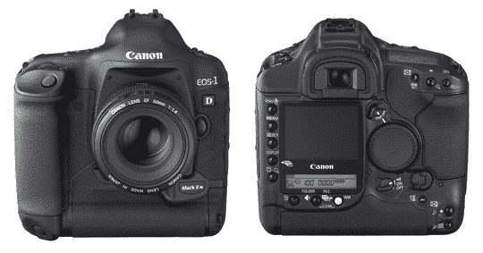

# 佳能为 EOS-1D Mark III 更新固件| TechCrunch

> 原文：<https://web.archive.org/web/http://techcrunch.com/2007/08/01/canon-updates-firmware-for-eos-1d-mark-iii/>

如果观众中有任何 EOS-1D Mark III 用户，那么请注意这次固件升级。如果意大利语和中文菜单屏幕上的错误让你暴跳如雷，那么立即升级到 v1.1.0。我不知道谁会对电池插入时相机不能正常启动感到恼火，但这也缓解了这个问题。液晶显示器上的图像也焕然一新。升级解决了操作主、快速控制和垂直手柄主转盘时的问题以及自动对焦问题。

[立即升级](https://web.archive.org/web/20160316035449/http://web.canon.jp/imaging/eos1dm3/firmware.html)