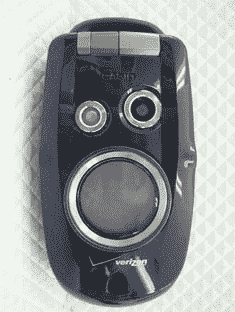

# 卡西欧 G'zOne Type-S 听起来像一道意大利面——TechCrunch

> 原文：<https://web.archive.org/web/http://techcrunch.com/2007/05/23/casio-gzone-type-s-sounds-like-a-pasta-dish/>

# 卡西欧 G'zOne Type-S 听起来像意大利面

你们当中那些粗犷的伐木工人会很高兴地知道，威瑞森将发布卡西欧的粗犷手机 G'zOne 的更新版本。这款手机被称为 G'zOne Type-S，不仅坚固耐用，听起来像一道糟糕的意大利菜，它还具有一个圆形的橡胶天线，可以用来泡妞。

不过，对于一部坚固的手机来说，Type-S 的设计相当不错。它有一个 VGA 摄像头，蓝牙，可以在几英尺的水中扣篮。这款手机刚刚获得 FCC 的批准，所以如果你是一个喜欢户外运动的人，请在第三季度寻找它。

[G'zOne Type-S 通过 FCC](https://web.archive.org/web/20220207033751/http://www.phonenews.com/content/view/2118/9/) 【电话新闻】