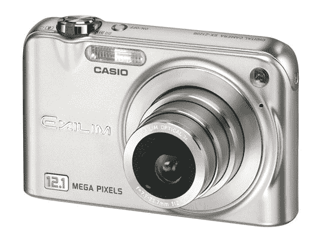

# 卡西欧推出 EXILIM Zoom EX-Z1200 | TechCrunch

> 原文：<https://web.archive.org/web/http://techcrunch.com/2007/05/21/casio-introduces-exilim-zoom-ex-z1200/>

今天，卡西欧停止计算百万像素。它今天决定 overkill 是一个新的黑色，这个新发现的想法是前 Z1200。这个庞然大物能够以令人难以置信的 1210 万像素分辨率拍摄照片。功能包括卡西欧的图像稳定技术，3 倍光学变焦，最新的 EXILIM 引擎，版本 2.0，小而薄的设计，以及电影模式。我相信你可以用这架相机拍出一些精彩的照片。

EX-Z1200 还有一个 2.8 英寸宽的 LCD，亮度更高。它还带有 34 个最佳拍摄功能，允许您轻松设置相机，在特定的设置下拍摄特定的照片。对卡西欧 EXILIM Zoom 系列的下一部感到兴奋吗？你必须等到 7 月中旬才能看到前 Z1200 的发布。这款手机售价 399 美元，有银色和黑色可选。