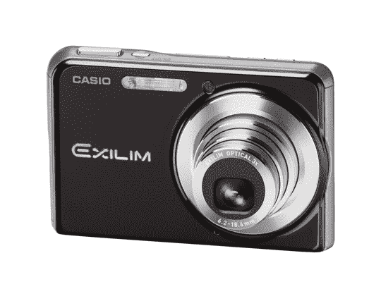
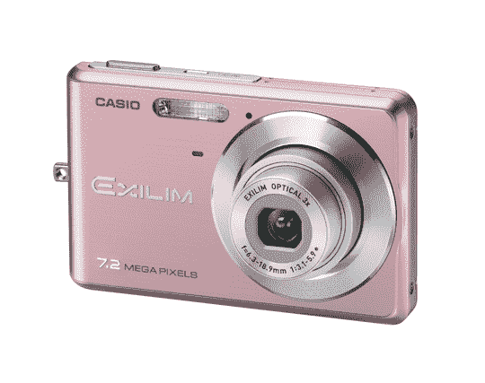

# 卡西欧发布两款新 Exilims 

> 原文：<https://web.archive.org/web/http://techcrunch.com/2007/07/10/casio-unveils-two-new-exilims/>

Exilim EX-S880

卡西欧今天在其广受欢迎的 Exilim 系列中推出了两款新的数码相机。EX-S880 和 EX-Z77 都具有 Exilim 通常具有的所有出色功能，如最佳拍摄技术、新的 EXILIM Engine 2.0 图像处理器和高质量视频捕捉。但是这两个摄像头里面也有 YouTube 的力量。

内置的 YouTube 捕获模式允许摄影师录制 H.264 编码的电影，当您通过内置的软件将设备连接到计算机时，这些电影可以立即上传到 YouTube。这种合作关系确实给了 YouTube 一个优势。人们将外出拍摄基本的视频，现在可以回家快速轻松地上传。

你可以花 229.99 美元买到 EX-Z77，或者花 299.99 美元买到 EX-S880。点击跳转获取前 Z77 的图片。哦啦啦。

[新闻稿](https://web.archive.org/web/20140917152847/http://www.casio.com/news/content/FA697694-BE89-42B4-86B6-7C1A1C575A27/)

