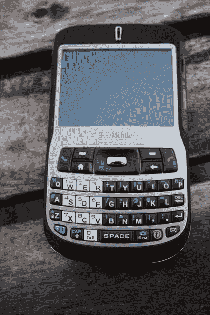

# 手机排毒大赛:第三天| TechCrunch

> 原文：<https://web.archive.org/web/http://techcrunch.com/2006/11/10/cell-phone-detox-contest-day-03/>

# 手机排毒大赛:第三天

这是 Biggsies 手机戒毒的第三天，他似乎变得更糟了。他高烧 103 度，还在服用奈奎尔(白天！)徒劳地试图诱导昏迷，并在剩下的 27 天里继续睡觉。

如果你认为这听起来很有趣，你很幸运，因为你可以在家加入。只需打开你的网络摄像头，录制一分钟的视频，告诉比格斯先生要坚强。或者，如果你像我一样是虐待狂，可以随意用一些火辣的手机动作来奚落他——因为他没有任何动作。

录制您的视频。用标签“嘎吱嘎吱”把它上传到 YouTube 上，并用电子邮件把视频链接发给 contest@crunchgear.com。在 11 月 20 日周一之前，浏览量最多的五个条目将出现在网站上，读者将在 11 月 21 日投票选出获胜者。