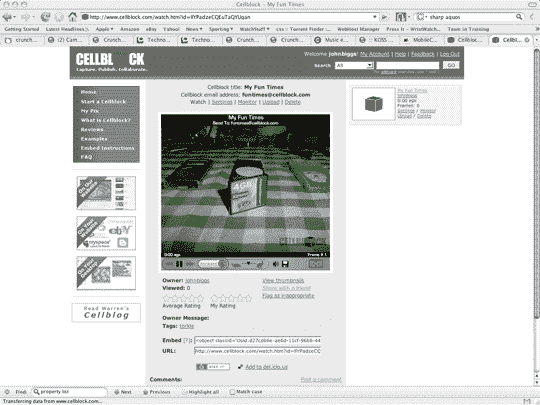

# Cellblock:快速视频和图像日志

> 原文：<https://web.archive.org/web/http://techcrunch.com/2007/02/28/cellblock-fast-video-and-image-vlogging/>

实际上，我对此很感兴趣，因为这可能是在节目或活动中发布“突发新闻”的一个很好的方式。这并不是什么新鲜事:你拍摄一些视频或图像，在发送后，它几乎立即在 Cellblock 窗口中弹出，没有代码转换或其他讨厌的事情。

这项服务使用一个标准的电子邮件地址——大概你可以从你的桌面上发送内容，但那不会有任何乐趣——并在收到内容后立即发布到一个可嵌入的播放器中。

[http://www.cellblock.com:80/flash/cellblockPlayer.swf?cbId = llypadzecqueutaqyuqan&mute = onStart](https://web.archive.org/web/20160407222442/http://www.cellblock.com:80/flash/cellblockPlayer.swf?cbId=llYPadzeCQEuTaQYUqan&mute=onStart)

事实上，上传是即时的，与我无关。真正的价值可能在于即时直播的博客事件，但这种应用是有限的。

不过，为了好玩，还是放弃吧。除非你想要增强版，否则你不必添加你自己的手机号码，所以它是相对安全的。

更新-不知道为什么没有声音。
更新 2——刚刚意识到你也可以生活在 bloggogogo！给 funtimes@cellblock.com 发邮件，尽情摇滚吧！

[牢房](https://web.archive.org/web/20160407222442/http://www.cellblock.com/)