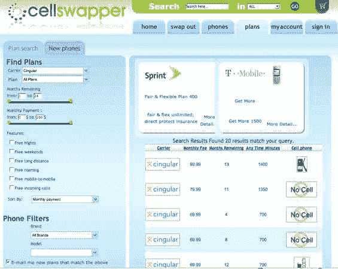

# CellSwapper 解决了一个非常烦人的问题 

> 原文：<https://web.archive.org/web/http://www.techcrunch.com:80/2007/01/11/cellswapper-is-like-magic/>

# CellSwapper 解决了一个非常烦人的问题

  位于新泽西的[cells swapper](https://web.archive.org/web/20220926092611/http://www.cellswapper.com/)是一项很酷的服务，来得正是时候。该网站自称为“手机合同的易贝”，它利用了这样一个事实，即所有美国手机运营商的合同中都有条款，允许用户提前退出，而无需支付每部手机高达 250 美元的提前终止费，只需将你的账户转移给其他人。

当然，找到其他人来接管你的手机合同并不容易，这就是 CellSwapper 的用武之地。接收方避免了一个 40 美元左右的新账户的激活费用，通常转移方会给予额外的奖励。在浏览列表的过程中，会有很多赠送手机和合同以及/或者现金奖励的提议。

如果成功转移，CellSwapper 将向转移用户收取 15 美元。没有其他费用。

我说这来得正是时候，因为包括我自己在内的许多人都将在今年 6 月份与 Cingular 一起发布的新 iPhone[时寻找摆脱手机合同的方法。我会很乐意给别人我的摩托罗拉 Q(好摆脱)加上 100 美元，以避免威瑞森终止费。](https://web.archive.org/web/20220926092611/http://www.beta.techcrunch.com/2007/01/09/apple-announces-iphone-stock-soars/)

CellSwapper 的成功取决于他们快速建立买家和卖家网络的能力。我们将在几个月后再次检查他们，看看他们做得怎么样。

