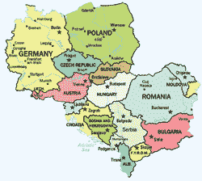

# 中欧会议？TechCrunch

> 原文：<https://web.archive.org/web/http://techcrunch.com/2007/07/05/central-european-meet-up/>

你好，中欧人。我目前在波兰华沙，我想知道我们附近城市的读者——克拉科夫、格但斯克、维也纳、罗兹、弗罗茨瓦夫、布达佩斯或布拉格——是否愿意在接下来的几周内见面并谈论技术。如果你住在这些城市或其附近，请给我发邮件到 crunchgear dot com 的 john，或者参加下面的投票，我会列出潜在的城市，然后根据兴趣出发。我真的很想和一些欧洲 CG 读者谈谈这些地方的科技。另外，如果一切按计划进行，我会为啤酒买单，我可能会有一部 iPhone 来炫耀。

{民主:17}