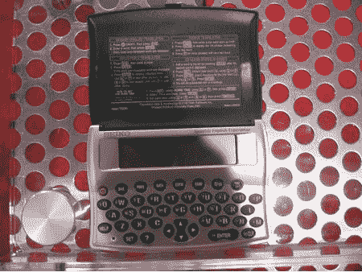

# CES 2007 Booooring Edition:Franklin 西班牙语-英语翻译

> 原文：<https://web.archive.org/web/http://techcrunch.com:80/2007/01/10/ces-2007-booooring-edition-franklin-spanish-english-translator/>

事实上，布雷克喜欢这个东西，因为它让他可以毫无争议地和拉吉说话。富兰克林的西班牙语-英语翻译器为您提供 800，000 条西班牙语到英语的翻译，它包含一本包含 5，500 个短语的短语手册(“你好，短文！”)，并且自带机智- *zzzzzzzz…*