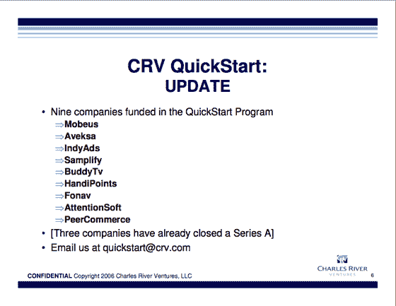

# 查尔斯河风险投资公司的天使实验:前九项投资

> 原文：<https://web.archive.org/web/http://www.techcrunch.com:80/2007/05/11/charles-river-ventures-angel-experiment-first-nine-investments/>

  当[Charles River Ventures](https://web.archive.org/web/20160913202811/http://www.techcrunch.com/2006/11/01/charles-river-ventures-goes-for-angel-market/)去年宣布其[快速启动计划](https://web.archive.org/web/20160913202811/http://www.crv.com/AboutCRV/QuickStart.html)为初创公司快速提供几十万美元时，在天使投资市场引起了小小的涟漪。

对于企业家来说，这是筹集资金的另一种选择，但我们采访的不止一位天使投资人对大基金进入他们非常有利可图的投资有点紧张。他们显然希望这种趋势不会被其他大型基金复制。

CRV 表示，他们将在头两年通过快速启动项目进行 25-50 笔投资。六个月后，他们将进行大约 40 项投资。到目前为止，已经完成了九项，并在我今天下午参加的斯坦福商学院快速推介活动中披露。其中三家已经完成了后续的 A 轮融资——Mobeus、Aveksa 和 Samplify。我们将在不久的将来讨论其中的一些内容。平均投资规模为 25 万美元。

现在判断这些投资是否会有回报还为时过早，但 CRV 总体表现非常好。他们表示，他们的 2000 年基金将为有限合伙人带来 2-3 倍的回报，以任何标准衡量，这都是一个极好的回报，尤其是考虑到 2000 年至 2004 年长达 4 年的核能投资寒冬。

