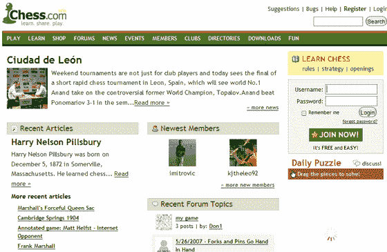

# Chess.com:社交网站...你可能会猜到 TechCrunch

> 原文：<https://web.archive.org/web/http://www.techcrunch.com:80/2007/07/08/chesscom-a-social-networking-site-forwell-you-can-probably-guess/>

# Chess.com:一个社交网站……你可能会猜到

 结束了我们为期一周的小众社交网络，来自国际象棋门户网站[Chess.com](https://web.archive.org/web/20230130100805/http://www.chess.com/)的一款新的社交网络产品问世了。

chess 致力于成为全球象棋玩家的首要在线社交网络社区。chess 旨在提供一个环境，让所有技能水平的棋手都可以学习，贡献，发挥，建设，聊天，和分享。

Chess.com 自带一系列标准功能，包括个人资料、博客、好友、活动、视频分享和电子邮件。该社交网络于 6 月推出，目前已有 10，000 名成员。

迎合小众受众并不一定需要美学上的美感(尽管无可否认它确实有所帮助)，内容和社区最终会推动成功。尽管《Chess.com》的一些成员把克里斯·皮里洛打扮得像布拉德·皮特，但毫无疑问，除了一个本身可能价值 100 万美元的网址之外，这个网站还有其他价值。如果你非常喜欢下棋，Chess.com 值得一游。
