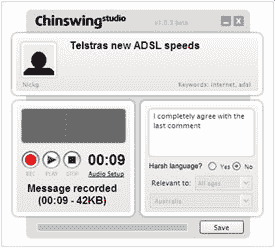
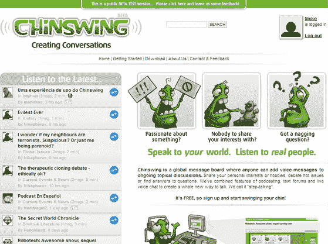

# Chinswing 为讨论板带来音频–tech crunch

> 原文：<https://web.archive.org/web/http://www.techcrunch.com:80/2006/12/08/chinswing-brings-audio-to-discussion-boards/>

# Chinswing 为讨论板带来音频

几周前，总部位于 T2 墨尔本的音频公告板“Chinswing ”( Chinswing ),用最少的天使投资悄然推出。这个概念非常直接。成员们通过在适当的类别频道(健康、电脑等)下留下一段录音开始讨论。)带有相关的标题和标签。

讨论线索是一系列框，由用户按照记录的顺序填写记录的评论。每个注释框也有几行描述注释的文本空间。通过 RSS、观察列表和播客可以很容易地了解每个主题频道和个人讨论的发展。线程可以一直线性播放，或者你可以开始在线程的下游播放。这使得一个非常简单的方式来消费音频，但线性格式剥夺了系统的曲折的子线程，有时螺旋离开评论。

为了发表你自己的评论，你必须下载并安装一个小的。包含录制软件的 msi (Microsoft Installer)文件。考虑到客户端简单的播放/暂停/录制功能，我更希望录制程序嵌入到 flash 中运行，比如卡拉 ok 服务 [Singshot](https://web.archive.org/web/20200920132920/http://www.beta.techcrunch.com/2006/07/30/singshot-enters-online-karaoke-space/) ，或者音频混合站点 [Jamglue](https://web.archive.org/web/20200920132920/http://www.beta.techcrunch.com/2006/11/09/the-y-combinator-companies/) 。

以前也有一些类似的服务遭到攻击:现已倒闭的音频博主、[、【Wildvoice】、](https://web.archive.org/web/20200920132920/http://wildvoice.com/) [Snapvine](https://web.archive.org/web/20200920132920/http://snapvine.com/) 和 [Evoca](https://web.archive.org/web/20200920132920/http://evoca.com/) 。与 Chinswing 和 Wildvoice 不同，Snapvine 和 Evoca 不是对话的目的地，而是将他们的技术整合为博客插件(Evoca)或 flash embed([snap vine)](https://web.archive.org/web/20200920132920/https://crunchbase.com/organization/snapvine))。Evoca 允许在电脑或手机上记录评论，而 Snapvine 则依靠用户通过电话拨号。

作为一个目的地，只允许一种评论模式(音频)可能会阻碍 Chinswing 的潜在增长。由于没有他们自己的插件潜在的病毒功能，Chinswing 不得不围绕他们的网站从头开始建立一个社区。他们只支持音频评论，也排除了任何想在讨论中发表意见的文字评论者。Youtube 等视频网站或 Odeo 等音频网站通过支持文本回复获得了大量用户互动。

