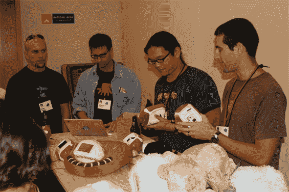
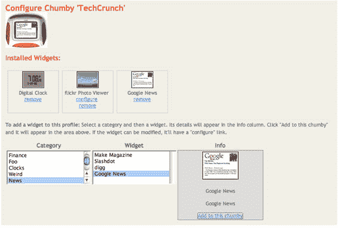

# 在 Foo 上分发 Chumby 设备

> 原文：<https://web.archive.org/web/http://www.techcrunch.com:80/2006/08/27/chumby-devices-handed-out-at-foo/>

[查姆比](https://web.archive.org/web/20211024100141/http://www.chumby.com/)的创始人想要创造一种新的设备，可以躲避黑客攻击。昨天，他们向大约 100 名参加加利福尼亚塞瓦斯托波尔 Foo Camp 的人介绍了他们新发明的样机。我很幸运得到一个。

Chumby 是一款支持 wifi 的小型触摸屏信息设备。当你把它从盒子里拿出来插上电源时，它实际上就是一个美化了的闹钟。但是当你花一点时间在他们的网站上注册你的特别好友，它可以变成你喜欢的任何东西。现在有很多小工具可用，只需点击一下就可以在 Chumby 上启用。由于 Chumby 是完全开源的，并为开发人员提供了 HDK 和 SDK，预计修改将很快出现。

我启用了一些可用的小工具，我的 Chumby 现在显示了我的 flickr 账户上的图片和谷歌新闻标题。其他 Foo 参与者在他们的 Chumby 上有新的 Digg 首页故事、Google 日历和 Slashdot 故事。

该设备具有 266MHz ARM 控制器、32MB SDRAM、320×240 3.5 英寸触摸 LCD 屏幕、两个扬声器、音频输出、麦克风输入功能和一个 USB 端口。Chumby 还有一个挤压传感器。所有这些都被包裹在一个柔软的、可压缩的、椰子大小的外壳中。

不喜欢你室友的某些地方？黑掉它。创始人不仅允许它，而且积极鼓励修改，甚至在 Foo 主持了一些黑客会议。硬件可以很容易地从外壳中取出，放入其他东西中。硬件本身可以被黑客攻击，或者开发者可以使用 Chumby 网站上的工具简单地创建新的小部件。

例子是无限的。例如，使用 USB 端口获取带有 MP3 的拇指驱动器，并构建音乐播放器小工具。或者 divx 播放器。或者用 Chumby 来控制你家的空调。或者作为电视机的遥控器。等等。

Chumby 要到 2007 年 3 月才能上市，但是开发者现在可以在 Chumby 主页上申请。告诉他们你为什么想要它，他们可能会送你一个。当它最终上市销售时，目标价位是 150 美元。基本服务是免费的，随着时间的推移，Chumby 可能会增加付费服务。

Chumby 团队的大多数成员，包括 Ken Steele、Bunnie Huang Joe Grand 和 Duane Maxwell，都在 Foo 演示该产品。下图是他们在主持一个 Chumby hack 会议。

更多关于[查姆比网站](https://web.archive.org/web/20211024100141/http://www.chumby.com/corporate/whatischumby)和[嘎吱齿轮](https://web.archive.org/web/20211024100141/http://crunchgear.com/2006/08/27/techcrunch-gets-chumy-with-chumby/)的信息。

