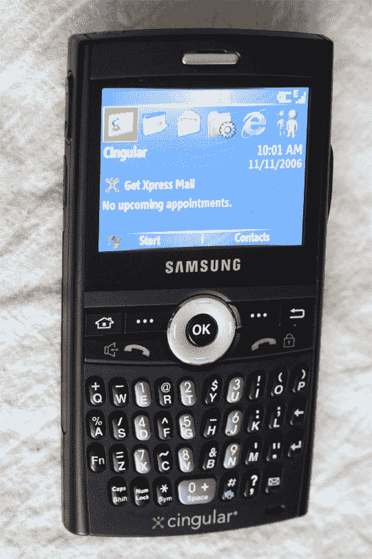

# Cingular 点回顾–TechCrunch

> 原文：<https://web.archive.org/web/http://techcrunch.com/2006/11/13/cingular-blackjack-review/>

我还是放弃吧。正如我之前明确表示的，我不喜欢 [Windows Mobile](https://web.archive.org/web/20201129130245/http://crunchgear.com/2006/11/03/smartphones-now-10-things-i-hate-about-smartphones/) 。这是一个美学上的选择，也是一个技术上的选择，但我他妈的知道什么。我只是一个博主。因此，考虑到这一点，我向大家介绍不可估量的 Cingular Blackjack，这是一款面向大众的功能丰富的超薄 Windows Mobile 5.0 智能手机。
 
“21 点”——就像 T-Mobile [Dash](crunchgear.com/2006/10/11/t-mobile-dash-hands-on/) 、 [Trace](crunchgear.com/2006/09/20/samsung-trace-quick-look) 和 [Fluffernutter](https://web.archive.org/web/20201129130245/http://homepage.mac.com/jlareau74/.Pictures/fluffernutter.jpg) 一样，是 Cingular 试图涉足同名事物的最新尝试。这是一款超薄的黑色智能手机，配有 130 万像素的摄像头。它运行在 Cingular 的 UMTS/HSDPA 3G 网络上，但这意味着什么呢？这意味着，在目前支持该技术的地区，网页浏览和电子邮件下载的速度快如闪电。

我中断了我的手机网络，尝试在曼哈顿打电话，那里的响应速度非常快，大约 700kbps。在布鲁克林，我们只有 EDGE，我在一个好的日子里达到了 2kbps，这是一个相当大的下降。这显示了良好 3G 网络的价值以及 EDGE 和 GPRS 数据流的匮乏。如果你在一个有 UMTS 的地区，并且依靠你的智能手机获取数据、邮件和网络下载，21 点表现得相当令人钦佩。

键盘的设计使用了黑莓的一些专利，这意味着三星能够使用 RIM 的倾斜按键设计。大多数相关的键都在正确的位置——一个 home 键和 back 键在键盘的两端，还有一个中央滚轮。在右边的滚轮下面还有一个后退按钮，也可以作为点击按钮。左侧有音量控制，顶部有电源按钮。

这款手机重约 3.5 盎司，重量轻得令人惊讶，背板由橡胶材料包覆，握感更好。屏幕非常明亮，可读性很强，默认的图标格式，屏幕顶部有四个大的应用程序，下面有一些消息和呼叫数据，可读性很强。电池续航时间令人印象深刻，待机约三天，正常使用约 20 小时，包括通话和大量网页浏览/电子邮件阅读。

21 点是针对商业专业人士的，这一点很清楚。它包括 Cingular 的 XPress 安全电子邮件和日历同步服务的链接，以及良好的移动通讯。它还包括 Cingular Video 和 Cingular Music，这是该公司的两项媒体服务，但在我们的测试中，除了流媒体 XM radio 之外，这两项服务都没有真正正常工作。因为它连接到的大多数网址的名称中都包含“21 点”，我怀疑 Cingular 在正式发布之前会保留这些内容。

这款手机包括 128MB 的闪存和一个用于扩展的 microSD 插槽。它支持 POP/IMAP 邮箱以及 Outlook Mobile 推送电子邮件。一旦在 Cingular 的网络上推出，它最终将拥有 PTT 功能。它还包括一个支持 AIM 的基本 IM 应用程序 Yahoo！Messenger 和 MSN。

总的来说，我可以推荐 21 点，而不是配备类似的 Moto Q 或没有 3G 速度的诺基亚 E62。它易于使用，符合人体工程学，重量轻。2004-2005 财年对三星来说是一个艰难的财年，它专注于低端机型，这些机型在外观或功能上没有赢得任何奖项。值得庆幸的是，像 21 点这样的手机和设备标志着三星进入了一个完全不同的时代。Windows Mobile 作为主要的移动操作系统胜出，所以我很难在这个帐户上指责手机。

如果您正在寻找一种轻松浏览网页、电子邮件和一些基本办公应用程序的方法，请仔细看看 21 点。Cingular 公司以 199 美元的价格出售这款产品，合同期为两年。