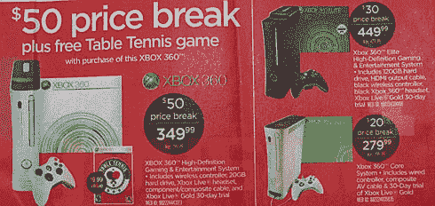

# 电路城广告确认所有 Xbox 360 系统降价

> 原文：<https://web.archive.org/web/http://techcrunch.com/2007/07/31/circuit-city-ad-confirms-price-cuts-for-all-xbox-360-systems/>

Xbox 360 核心系统的命运仍然悬而未决，但这个电玩城广告几乎证实了所有 360 系统的降价。从 8 月 12 日开始，精英版的价格下降了 30 美元，降至更实惠的 449.99 美元，高级版降至 349.99 美元，核心系统现在与 Wii 竞争 279.99 美元。如果降价还不足以让你进入商店，那么免费赠送一本摇滚明星的*乒乓球*怎么样？

[Circuit City 传单显示 Xbox 360 在所有系统上都降价](https://web.archive.org/web/20150912011900/http://www.joystiq.com/2007/07/31/circuit-city-flyer-shows-xbox-360-price-drop-on-all-systems/)【Joystiq】