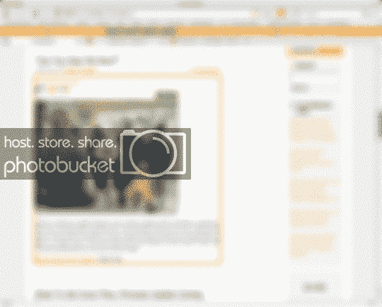
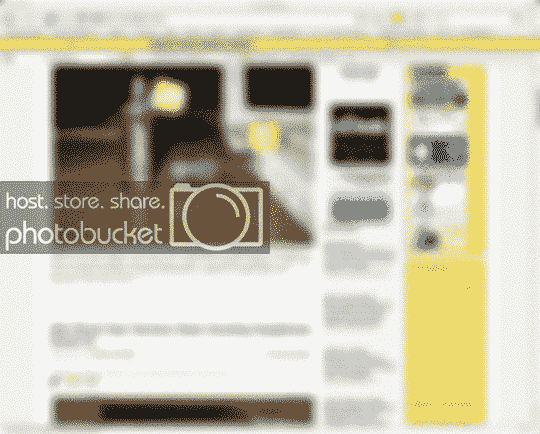
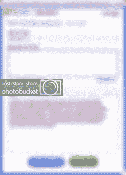
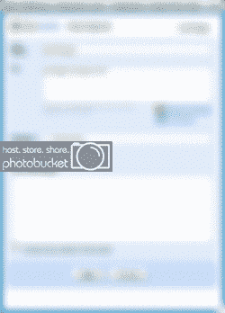

# Clipmarks:网络荧光笔 TechCrunch

> 原文：<https://web.archive.org/web/http://www.techcrunch.com:80/2007/02/27/clipmarks-a-highlighter-for-the-web/>

# Clipmarks:网页荧光笔

[Clipmarks](https://web.archive.org/web/20221006071352/http://www.beta.techcrunch.com/2006/10/24/the-new-mozilla-recommended-add-ons-list-the-winners-and-the-losers/)的纽约团队刚刚推出了他们产品的 2.0 版本，这是一个独特的网络剪辑系统，允许你从一个页面中截取你想要的段落、句子或多媒体，同时保持与原始文档的链接。

他们的首席执行官 Eric Goldstein 是一名律师，他厌倦了将引文剪切并粘贴到 Word 文件中，却发现 100 页的文件变得无法阅读和使用。他和他的团队推出了该产品的第一个版本，马歇尔几个月前就看过了，但最新版本的功能更加全面，也非常有趣。

该产品是一个 Mozilla/Firefox 或 IE 插件，可以调出交互式剪辑菜单。当你在文本上滚动时，Clipmarks 会高亮显示它，并允许你将其剪辑到电子邮件、博客(包括 WordPress 和 Blogger 在内的许多 CMSes 都支持)中，以便打印或保存。这些剪辑存储在 Clipmarks 服务器上，可以“弹出”到首页与其他读者分享。

这些流行的故事允许投票，并且在主页上有一个流行故事的流水账。戈尔茨坦提到，没有办法投票反对一个故事，所以故事只能上升或逐渐消失，而不是被邪恶的流行游戏玩家降级。

社交方面仅次于获取文本片段、存储它们、甚至在博客帖子中使用它们的实际用途。有许多 Javascript 工具可以执行类似的任务，但是 Clipmarks 提供的格式选择和方法并不显眼，而且可能会让人上瘾。

在我使用它的短暂时间里，我能够抓取视频、单个句子，甚至整篇文章，并将它们拖到多个位置。在 Firefox 的菜单栏旁边有一个巨大的 Clipmarks 按钮，如果你不小心点击它，就会发现页面上的所有内容都出现了区块，这真的很烦人，但对于所提供的功能来说，这只是一个小小的代价。

[剪辑标记](https://web.archive.org/web/20221006071352/http://www.clipmarks.com/)