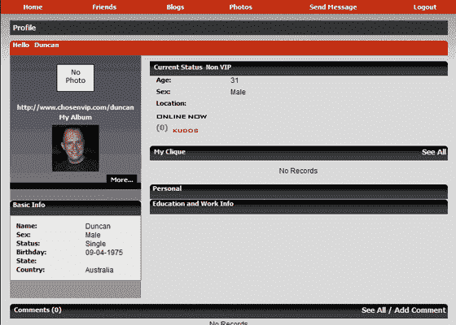

# 小团体:ChosenVIP 

> 原文：<https://web.archive.org/web/http://www.techcrunch.com:80/2007/05/14/clique-this-chosenvip/>

# 小团体:ChosenVIP

总部位于休斯顿的 ChosenVIP 是一个在线社区，它包含了许多人认为的高中最糟糕的事情，社交圈子。

该公司将自己定位为给“普通人”成为“电子名人”的机会。成员们使用这个网站从朋友那里创建他们自己的小团体。通过评级系统，用户将自己与他人区分开来，并获得“VIP 身份”。非 VIP 从当前 VIP 会员那里获得身份。VIP 会员决定谁将作为 VIP 加入他们，谁不会。

听起来像高中？情况变得更糟。

当获得 VIP 身份后，用户可以努力成为网站上排名最高的成员，队长~~啦啦队长~~加尔或者~~运动员~~盖伊。VIP 会员获得额外的特权，仅 VIP 聊天和论坛访问，决定谁加入 VIP 团体，能够评价其他 VIP 会员以及赢得比赛和奖品的资格。

评级在每个周期结束时重置排名，给非 VIP 的一些希望，但是 VIP 会员仍然是 VIP 会员，不必重新开始。有趣的是，每一期的顶级男女贵宾可以在他们的家乡、当地俱乐部或附近的场地以获胜者的名义获得一个免费的 ChosenVIP 派对。

这是一种创新的商业模式，旨在挖掘人类的原始欲望，使自己处于顶端。它并不适合所有人，但它会吸引那些还在高中的人，或者那些带着玫瑰色眼镜渴望回顾那些日子的人，因为那是他们生命中最美好的时光。

