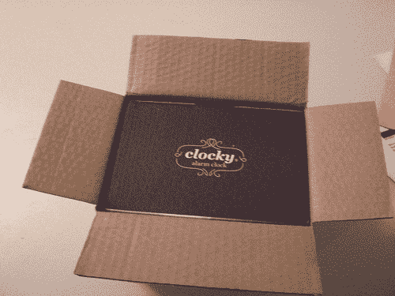
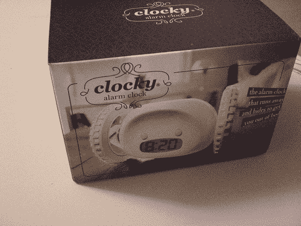
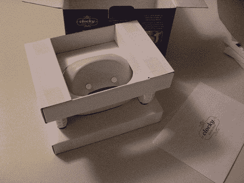
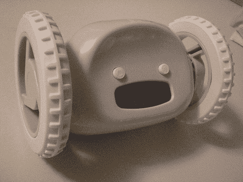

# Clocky:拆箱

> 原文：<https://web.archive.org/web/http://techcrunch.com:80/2007/03/26/clocky-the-unboxing/>

虽然我周五对 Clocky 做了一个非常简短的“视频概述”，但我想我会与你分享一些拆箱图片，因为 Clocky 有着看起来很棒的包装。还需要注意的是，Clocky 只需要 50 美元，而不是 60 美元。

哦！今天早上我用 Clocky 当闹钟。结果呢？我从床上爬起来，爬到我的桌子下面去关掉这个小家伙。成功了！开始行动吧。

 

多可爱啊！

[Clocky 官方网站](https://web.archive.org/web/20220809030351/http://www.nandahome.com/)
早些时候: [Clocky:一个简短的视频回顾](https://web.archive.org/web/20220809030351/http://crunchgear.com/2007/03/23/clocky-a-brief-video-review/)