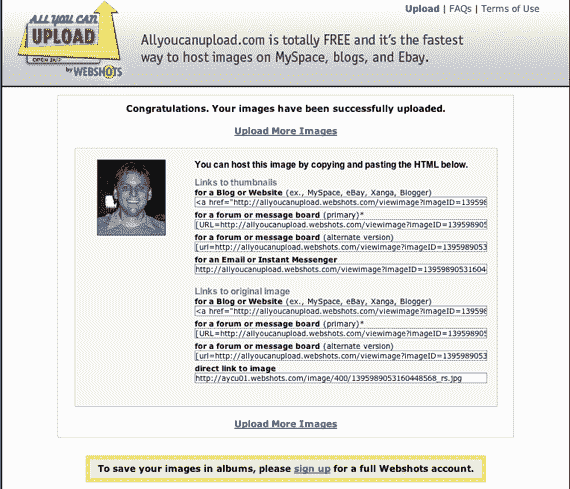

# CNET 的 AllYouCanUpload 是颠覆性的——TechCrunch

> 原文：<https://web.archive.org/web/http://www.techcrunch.com:80/2006/05/29/cnets-allyoucanupload-is-disruptive/>

  CNET 上周非常低调地推出了一个名为 [AllYouCanUpload](https://web.archive.org/web/20210921233244/http://allyoucanupload.com/) 的简单的新照片上传网站。乍一看，它似乎没有什么特别或破坏性。但事实如此。

通过推出 AllYouCanUpload，CNET 刚刚从至少两家初创公司( [photobucket](https://web.archive.org/web/20210921233244/http://www.photobucket.com/) 和 [imageshack](https://web.archive.org/web/20210921233244/http://www.imageshack.us/) )的困境中走了出来，这两家公司专注于为那些希望在 Myspace、易贝等网站上展示图片的用户提供图片托管服务。这是一个大生意——[今天有大量的流量通过 photobucket](https://web.archive.org/web/20210921233244/http://www.beta.techcrunch.com/2006/04/19/2-of-us-internet-traffic-through-photobucket/) 流动，这是一家盈利且资金充足的[公司。](https://web.archive.org/web/20210921233244/http://www.beta.techcrunch.com/2006/05/14/photobucket-closes-105-from-trinity-ventures/)

AllYouCanUpload 是一个让上传照片变得尽可能简单的网站。他们消除了所有的摩擦。你不需要注册账户。你只需使用上传工具，你就会看到图片和代码，以便将照片发布到 Myspace、ebay 和其他网站上(我也希望可以选择将图片链接通过电子邮件发送给我)。与 Photobucket 和 Imageshack 不同，AllYouCanUpload 是完全免费的，网站的上传区域不会出现任何广告(网站的托管部分会有广告，如果你点击托管的图片就会看到)。可以上传的照片数量或可以消耗的存储总量没有限制。图像的大小没有限制，除非您要求，否则图像不会调整大小。可能最重要的是，绝对没有带宽限制。

最后一点很重要。对于其他服务，带宽是有上限的。这意味着，如果一张照片特别受欢迎，被大量浏览，用户帐户将在达到上限后被关闭。这不会发生在 AllYouCanUpload 身上。

这不是一个目的地网站-如果你丢失或忘记了你的照片的网址，你将不得不重新上传它们，因为没有搜索功能或用户帐户。CNET 建议你去 Webshots，他们的主要照片网站，如果你想要这些目的地网站的功能。但是对于 Myspace 和其他社交网站的用户来说，AllYouCanUpload 是一个非常酷的网站。如果它获得了牵引力(即使没有 CNET 的支持，它也会获得牵引力)，它将迫使 PhotoBucket 和 Imageshack 重新考虑他们的产品。这对消费者来说非常好。

参见[马丁·格林的博客](https://web.archive.org/web/20210921233244/http://martingreen.typepad.com/forward_looking_statement/2006/05/allyoucanupload.html) (CNET 社区集团总经理)对该产品的深入讨论，包括 CNET 新的后端存储解决方案“Haystack”。

**最后一点:**我们看到越来越多的新网络应用程序不断增加新功能，以至于几乎无法理解它们在做什么。当我看到这样的东西——一个努力高效、无摩擦地做一件事的服务，心里暖暖的。简单不等于无聊。简单也可能是破坏性的。我想要更多像 AllYouCanUpload 这样的服务。

