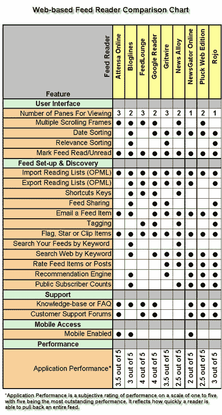

# 在线阅读器的现状

> 原文：<https://web.archive.org/web/http://techcrunch.com/2006/03/30/the-state-of-online-feed-readers/comment-page-14/>

毫无疑问，联合是 web 2.0 运动的核心。订阅源阅读器是消费合成内容的最常见的解决方案，它通过监控无数的站点和来源并向一个位置提供近乎实时的更新来节省用户的时间。

有许多不同类型的阅读器:基于网络的，基于桌面的，基于 Outlook 的，等等。这篇文章只关注基于网络的阅读器。我已经包括了大家伙，加上一些有突出功能和/或性能的新兴读者，如 News Alloy、Gritwire、Attensa 和 FeedLounge。

除了 FeedLounge 每月收费 5 美元之外，所有被评论的网络阅读器都是免费的。

## 基于网络的阅读器

我调查了九个基于网络的阅读器(关于之前对它们的评论，见 [TechCrunch 索引](https://web.archive.org/web/20100903084557/http://www.techcrunch.com/company-index/)):

我没有评估最广泛使用的网络阅读器 MyYahoo，或类似的产品，如 Live.com、谷歌 IG 和 Netvibes，因为这些都是更多的虚拟桌面应用程序或内置 RSS 阅读的门户网站。重度 RSS 用户需要一个更具工业实力的应用程序，就像我上面列出的那些。我相信 MyYahoo 是一个很好的选择，可以快速阅读你的订阅源，或者让那些通过手机或手持设备浏览互联网的移动订阅源读者，但是这项服务没有为大量信息消费者设置的功能。

对这九位读者的研究进一步强调了围绕这一行业发展的极其激烈的竞争氛围。仅以功能集为基础，有两家公司脱颖而出:罗约和博客在线。

Google Reader 和 FeedLounge 赢得了我的主观 feed-load 测试，该测试决定了应用程序获取特定 feed 的能力。测试包括加载五个提要，取加载时间的平均值，并按五分制对阅读器进行评级。有趣的是，FeedLounge 是该集团唯一的高级服务，每月 5 美元。除了出色的性能评级，我想知道 FeedLounge 与其免费竞争对手的区别还在于什么。然而，许多用户对 FeedLounge、Attensa 和 Gritwire 都提供的三屏阅读器非常着迷。

## Web 2.0 特性

罗约，一家总部位于旧金山的公司，之前在 TechCrunch 上被评论过，拥有最突出的 web 2.0 霸气。News Alloy 紧随其后，提供了标签、评级和其他内容重新定位(例如，添加到 Digg，添加到 del.icio.us)。

用户评分:一些读者提供评分系统，但我认为罗约的“魔咒”最有吸引力。Mojo 是一个反映用户生成评论的术语，反映了流行的社交新闻聚合器 digg 的一个功能。在 feed 中输入一个条目后，你可以用 Mojo 来增加它的相关性。NewsGator Online 还提供了一个名为“最新动态”的用户生成内容功能，它确定并显示链接到 NewsGator 中项目的人数。News Alloy 采用了一种类似于罗约的评级系统，记录人们对一个项目进行评级的次数。

**标签:**罗约从用户生成的标签中生成标签云。谷歌阅读器以不同的名字“标签”提供相同的功能 FeedLounge 似乎使用标签作为唯一的搜索和发现机制。新闻合金也允许标签的职位。

**社交方面:**罗约和格里特维尔的特色是“联系人”，它为读者增加了社交方面，允许用户在联系人网络中分享信息。

**Feed Discovery &推荐:**总部位于德克萨斯州的社交媒体公司 pull 在其网页版中内置了一个名为 FeedFinder 的功能，该功能改进了 Feed Discovery。当你浏览的时候，罗约推荐会出现在页面的右上角。

## 崭露头角的读者

位于波特兰的 Attensa 公司提供了一款界面非常专业简洁的阅读器。虽然缺少其他同类产品的许多特性，但它能很快提升饲料。在与 Attensa 的产品总监 Matthew Bookspan 的交谈中，我了解到 Attensa 将推出一款新的改进版网络阅读器，在对比图表上应该会表现得更好。此外，Attensa 将很快提供其阅读器的移动视图，在手持设备或手机上呈现得很好。

Gritwire 是一家位于芝加哥北部的公司，拥有一款基于 Flash 的阅读器，性能非常好，并提供类似于罗约的集成社交网络功能。Gritwire 使用联系人列表的方式，允许你在朋友之间共享 feeds。我与 Gritwire 的联合创始人和首席运营官伊恩·卡斯维尔(Ian Carswell)进行了交谈，他说 Gritwire 还有更多的 web 2.0 功能，我很想看到它们的实际应用。

News Alloy 提供了一个 Ajax 驱动的阅读器，为高级用户提供了很多功能。虽然它在主观馈送负载测试中表现不佳，但 Mike [之前在 TechCrunch](https://web.archive.org/web/20100903084557/http://www.techcrunch.com/2006/01/29/newsalloy-reader-fast) 上对它进行了审查，发现它在其他操作中速度极快。

## 功能比较图表

图表总结了在比较这些读者时进行的研究。我无法与每家公司直接对话，所以我可能错过了一些细节。请将此图表视为一份活文档，如果有更多信息，可以随时更新。此外，我在这张图表中遗漏了一些竞争对手——有如此多的网络读者，我不得不将研究局限于我认为的该领域的主要参与者。

## 摘要

如果你纯粹是为了性能，谷歌阅读器和 FeedLounge 是我们测试中最快的。如果你正在寻找一个功能丰富的应用程序，Bloglines 和罗约是最好的选择(而罗约在“web 2.0”类型的功能上击败了 Bloglines)。

然而，没有一个能达到最好的桌面阅读器如 NetNewsWire 和 FeedDemon 的速度和灵活性。

编者按:弗兰克·格鲁伯(Frank Gruber)写了一篇很棒的博客[有点坦率](https://web.archive.org/web/20100903084557/http://www.somewhatfrank.com/home.aspx)，他接受了我们在 TechCrunch 上写这篇研究文章的邀请。谢谢你，弗兰克。

**更新:**2006 年 3 月 31 日(图表更新)