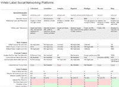
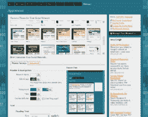
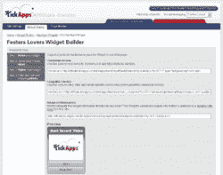
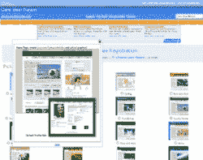
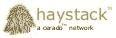
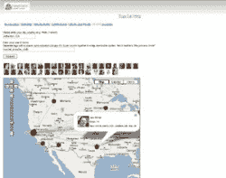
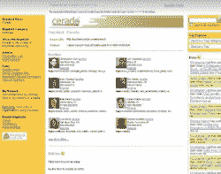

# 建立自己社交网络的九种方法

> 原文：<https://web.archive.org/web/http://techcrunch.com:80/2007/07/24/9-ways-to-build-your-own-social-network/comment-page-7/>

新闻中可能充斥着关于社交网络巨头的故事，如[脸书](https://web.archive.org/web/20100527060512/http://www.crunchbase.com/company/Facebook)和 [MySpace](https://web.archive.org/web/20100527060512/http://www.myspace.com/) ，但一大群公司正在尽最大努力将这些网站的基本功能简化为纯粹的商品。这些崭露头角的公司提供所谓的“白标”社交网络平台，使其客户能够建立自己的社交网络(通常从零开始)，并根据一系列目的定制这些网络。

给网络贴上白色标签的想法是让平台提供商尽可能不被社交网络的用户看到，并给网络打上建设者身份或意图的烙印。虽然“社交网络”的定义可能有所不同，但社交网络主要是由成员档案和某种用户生成的内容来定义的。

在白牌社交网络领域，大致出现了三种类型的公司。第一个提供托管的、自己动手的解决方案，客户可以通过这些解决方案点击进入一个全新的社交网络。这种类型的公司很少与客户互动，而是专注于提供他们需要的网络构建工具。

我们选取了其中的九家公司作为样本——[宁](https://web.archive.org/web/20100527060512/http://www.crunchbase.com/company/ning)、 [KickApps](https://web.archive.org/web/20100527060512/http://www.crunchbase.com/company/kickapps) 、 [CrowdVine](https://web.archive.org/web/20100527060512/http://www.crunchbase.com/company/crowdvine) 、[going](https://web.archive.org/web/20100527060512/http://www.crunchbase.com/company/goingon)、 [CollectiveX](https://web.archive.org/web/20100527060512/http://www.crunchbase.com/company/collectivex) 、[、](https://web.archive.org/web/20100527060512/http://www.crunchbase.com/company/me-com)、 [PeopleAggregator](https://web.archive.org/web/20100527060512/http://www.crunchbase.com/company/broadbandmechanics) 、 [Haystack](https://web.archive.org/web/20100527060512/http://www.crunchbase.com/company/cerado) 和 [ONEsite](https://web.archive.org/web/20100527060512/http://www.crunchbase.com/company/onesite) ，所有这些公司都提供免费的基线服务，下面分别对它们进行了回顾。我们还包括了右边的图表，总结了所有这些公司的产品。对这些公司的初步研究归功于 Jeremiah Owyang，他编制了一份白色标签社交网络服务的综合清单。

第二种类型的公司提供社交网络软件供下载并安装到自己的服务器上。第三种类型与客户密切合作，根据他们的需求建立社交网络。这些公司可能比任何自己动手的社交网络服务更适合你的需求，所以你可能想看看像社交平台(个性化服务)或 phpFox(可下载的解决方案)这样的公司。我们将在这篇文章的第二部分深入了解这些服务。

在我们下面要介绍的服务中，我们发现宁提供了一个最好的平台，让你不费吹灰之力就能建立起漂亮、复杂的社交网络。KickApps 提供了将社交网络组件集成到现有网站的最佳平台。CrowdVine 和 Haystack 是寻求简单社交网络以改善在线个性化交流的组织的可行选择。CollectiveX 最适合希望在线协作的现有团体。GoingOn 提供了一个很有前景的混合解决方案，其功能由 Ning 和 KickApps 共享。

下面是关于每一个的更多细节。

**宁**

宁(中文意思是“和平”，如果你想知道的话)目前提供了一个从零开始建立功能齐全、视觉上吸引人的社交网络的最佳平台。虽然宁试图提供与一样的现成服务，但它的竞争对手还没有一家能比得上其产品的专业性。

迄今为止，该公司出色的执行能力为其赢得了 7.6 万个托管网络(尽管浏览宁的“热门”网络列表，你会强烈地感觉到，这些网络中的绝大多数是由轮胎踢球者建立的，但很快就被抛弃了)。

标准的 Ning 包允许分支机构免费建立一个广告支持的网络，具有他们提供的所有功能。这需要一个点击式的设置过程，在这个过程中，代销商选择一个主题，调整外观，并加载照片、视频、群组和博客等功能。几分钟之内，这家代销商就创建了一个令人印象深刻、功能齐全(尽管有点千篇一律)的网络，准备接受第一批会员，可以通过电子邮件或 Ning ID 邀请。

 对大多数分支机构来说，建立稳固网络的便利性将是卖点。然而，Ning 也为更高级的分支机构提供服务，允许网络部分突破标准的 Ning 格式。分支机构可以禁用广告或运行自己的广告，每月收费 20 美元，他们可以屏蔽自己网络的网址，每月只需 5 美元。此外，当他们需要高级定制时，他们可以访问 Ning 的全面的[开发人员文档](https://web.archive.org/web/20100527060512/http://documentation.ning.com/)和 API。实际上，他们的 API 允许开发者使用标准的 Ning 网络并对其进行重组，而 KickApps ( [将在下面的](#kickapps)中讨论)通过为开发者提供一个简单的基础来鼓励高级定制。

虽然可以通过移除顶部的 Ning 工具栏和屏蔽 URL 来使 Ning 平台几乎完全不可见，但是由 Ning 托管的所有网络共享相同的用户基础。当用户以会员身份加入您的 Ning 网络时，他或她会获得一个可在所有其他 Ning 网络中使用的阿宁 ID。一方面，该系统简化了用户注册一个以上网络的过程。另一方面，它不断提醒人们，该网络实际上是由一个白色标签的社交网络平台托管的。许多分支机构根本不会介意这个系统，但是其他想要完全标记他们社区的人会认为这是一种贬低。

**KickApps**

 宁在你构建社交网络的过程中全程陪伴着你， [KickApps](https://web.archive.org/web/20100527060512/http://www.crunchbase.com/company/kickapps) 则更多地面向那些希望将社交网络功能整合到现有网站中，而无需自己编码和维护这些功能的网站开发人员(以及拥有网站开发人员的公司)。因此，当你开始用 KickApps 构建你的社交网络时，你会看到一个非常平淡无奇的默认模板，然后你必须塑造它来创建任何有吸引力的东西。Ning 帮助你用预制的模板定制你的网络，而 KickApps 让开发者更直接地控制页眉页脚代码和 CSS 样式。因此，让 KickApps 网络看起来更好需要更多的时间和专业知识，但最终它可能会比 Ning 上的任何网络看起来更无缝和专业。

KickApps 提供的其他功能强调了其社交网络组件很好地集成到现有网站的意图。该公司允许你免费定制你的网络网址，这样用户就不会觉得他们离开了一个主网站。同样免费:所有多媒体内容(视频、音频、照片等)的无限存储和带宽。)你希望你的用户上传。此外，每个网络都有自己的用户群，因此会员们会觉得他们注册的是一个特定的网络，而不是一个平台(就像 ning 的通用 ID 系统一样)。最重要的是，该公司愿意与分支机构单独合作，尽可能使他们的平台不可见(通过删除所有对 KickApps 的引用等)。

 KickApps 的广告方案尤为独特。虽然其他平台对关闭支持其免费服务的广告收取统一费用，但 KickApps 遵循按效果付费的模式，即选择关闭或运行自己广告的会员只需向 KickApps 支付与其网络流量成比例的费用。有了这个免费平台包，除了一个单独的摩天大楼区域之外，代销商网络的所有区域都由 KickApps 控制。然而，一旦代销商决定控制广告，它就要为其网络的每 1000 次页面浏览量支付大约 2-5 美元，费率随着流量的增长而降低。

KickApps 还提供了一套最强大的小工具创建工具，旨在帮助代销商通过病毒式营销推广他们的网络。分支机构通过易于使用的控制面板创建的小部件显示在特定网络上共享或制作的内容，并可以嵌入到其他网站或社交网络中。这些小部件通过将与小部件交互的任何人引导回它所来自的网络，将流量驱动到一个人的网络。

KickApps 的 4000 个网络与宁的 76000 个相比可能相形见绌，但随着该公司继续推出新功能，它似乎越来越受欢迎。其平台最近发布的 v2.2 提高了平台的视频和内容审核能力，并表明该公司正朝着提供更好的快速轻松定制工具的方向发展，从而与宁更直接地竞争外行的光顾。与此同时，KickApps 正在开发一个广泛的 API(目前处于私人测试阶段),这将加强其作为 web 开发人员服务提供商的主要角色。

**众筹**

[crowd vine](https://web.archive.org/web/20100527060512/http://www.crunchbase.com/company/CrowdVine)也许并不漂亮，也不复杂，但这不是它的本意。直到最近，由托尼·斯塔布尔宾(Tony Stubblebine)所体现的独角戏，CrowdVine 为那些寻求建立自己的社交网络的人提供了最简单、最基本的解决方案。

crowd vine 的主要功能是会员资料、博客帖子和公共信息。你不会在基本包中找到任何丰富的媒体共享功能，如照片和视频，因为托尼希望 CrowdVine 完全是为了连接人们，而不是分享他们的自我表达形式。因此，该平台主要吸引了会议组织者和与会者、校友(企业和学校)、内部网用户和专业人士。

缺乏对个人社交网络观感的控制证实了 CrowdVine 作为公用事业提供商的想法。让所有成员回答特定于网络的问题这一相当独特的功能也是如此，这些问题的答案将成为标签，便于按标准浏览成员。例如， [PodCamp Atlanta](https://web.archive.org/web/20100527060512/http://podcampatlanta.crowdvine.com/) 网络的新成员被问及他们的兴趣和专长，他们的回答成为网络主页上的链接标签，使访问者能够查看成员，例如，通过他们对“博客”的兴趣或“视频制作”的专长。

虽然 Tony 并不急于向 CrowdVine 添加功能，但他很乐意与分支机构合作，为他们的网络添加功能。Foo Camp network[通过整合日历和 wiki 支持以及成员的颜色编码，充分利用了 Tony 的可访问性。Tony 也愿意与分支机构合作，建立自定义网址并停用广告(当然是收费的)，从而实现更多的“白标”效果。](https://web.archive.org/web/20100527060512/http://foocamp.crowdvine.com/)

**怎么回事**

[【正在进行】](https://web.archive.org/web/20100527060512/http://www.crunchbase.com/company/GoingOn)(仍在测试阶段)的代表承认他们的网站很丑(而且，我应该补充一下，相当混乱)，但外表往往掩盖了这家公司平台的潜力，该平台旨在跨越宁和 KickApps 之间的鸿沟。GoingOn 建立在 Drupal 的基础上，提供简单的网络设置，但该公司也与媒体公司合作(取得了诸如[福布斯办公室恶作剧](https://web.archive.org/web/20100527060512/http://officepranks.forbes.com/)和[美国超级明星杂志休息室](https://web.archive.org/web/20100527060512/http://lounge.americansuperstarmag.com/)的成果)，将社交网络整合到现有网站中，如 KickApps。

 目前，going 既不执行这些服务，也不执行 Ning 或 KickApps。然而，它的平台确实比这两家公司提供了更广泛的功能(不幸的是，这些功能中的大部分，或“模块”，目前都是半生不熟的)。如果你需要 Ning 和 KickApps 目前都没有提供的功能，那么处理 GoingOn 的测试版所带来的所有不完善之处可能是非常值得的。

有一些结构和战略方面的事情值得在未来一年中跟踪。由于它是基于 Drupal 的，该公司声称它可以更容易地在其平台上部署开源软件包。随着时间的推移，这将转化为更多的功能，这可能有助于它保持对主要竞争对手的功能领先优势。它的 Drupal 传统也促进了 Drupalesque API 的创建，该公司坚持计划在年底推出该 API。

自称为“网络中的网络”的 GoingOn 为其托管的网络维护着一个共享用户群。然而，与 Ning 不同的是，它明确计划通过在网络中提供网络来利用这种共享认证系统。例如，教师在某一点上可能能够加入一个全国性的网络，该网络包含该国学区的子网络。嵌套网络的可能性可能会使等级组织处于边缘。

分支机构可以从五个正在进行的网络包中选择一个，每个包都提供越来越多的定制功能。大多数分支机构可能会在免费网络和专业网络之间选择，后者每月花费 20 美元，但允许分支机构管理他们的广告。自定义网址是免费的所有软件包。

 [CollectiveX](https://web.archive.org/web/20100527060512/http://www.crunchbase.com/company/CollectiveX)是一个边缘性的白标社交网络平台。它的可质疑性来自于它对排他性群体的定位(“群体网站”是“网络”的代名词)，以及它非常狭窄的定制选项范围。此外，一个集体群体的成员不能成为彼此的朋友，因此它缺乏几乎所有社交网络的基本特征(显然，它假定一个群体中的每个人都互相认识)。

然而，除了这些特质之外，CollectiveX 还提供了一种令人印象深刻的方式，让人们在一个受控的社交网络环境中分享信息和内容。CollectiveX 网站的主要功能包括日历、论坛和文件区(用于一般上传，特别是照片)。这些产品并不广泛，但是“质量重于数量”这句话确实适用。

CollectiveX 的独特之处在于，网络成员能够列出个人目标，并声明他们与特定个人的任何“关键联系”(即关系)。这些功能强化了这样一种感觉，即群组网站主要是为那些除了与同事进行在线协作之外，还希望建立关系网(从商业角度来说)的商业专业人士服务的。

尽管 CollectiveX 的免费套装和其他平台一样，也是靠广告支撑，但该公司的策略似乎特别专注于通过销售高级功能来赚钱。每月 9 美元，网络管理员可以删除广告，但显然没有办法运行自己的广告。每月额外支付 9 美元，管理员还可以获得对组权限的更多控制，通过 128 位 SSL 加密增强网络安全性，并将存储容量增加到 3gb。只需一次性支付 99 美元，CollectiveX 就会给你的网络贴上“白标”,基本上只需要把你自己的图片放到标题里，然后从另一个用户群导入成员。

 运行在 SNAPP 软件之上的 Me.com 是白色标签社交网络平台的聚友空间(我指的是贬义)。和宁一样，他的想法是用最少的步骤建立一个网络。然而，Me.com 的每个主题都很碍眼，更糟糕的是，整个默认网络的元素组织非常糟糕。如果你喜欢 MySpace 这种用户界面设计方式，那么你就在家里了。就我而言，一看到这东西就头疼。

撇开风格的考虑不谈，Me.com 提供了丰富的特性，尽管其中许多都没有得到很好的实现。例如，音频和视频部分不支持文件上传；实际上，您必须使用网络摄像头或类似设备将媒体直接录制到浏览器中。

最奇怪的是汽车部分，你可以列出你拥有/曾经拥有/想要拥有/梦想拥有的汽车，等等。撇开批评不谈，Me.com 确实在每个网络中集成了一个非常漂亮的聊天小程序，但对于大多数其他平台来说就不一样了。

Me.com 上的  网络套餐有三种口味，在[功能表](https://web.archive.org/web/20100527060512/http://www.me.com/snappchart.php)中可以方便地相互比较。当然，最大的区别在于免费的广告支持包和其他两个包之间。最低限度(！)每月 199 美元，分支机构可以控制广告，定制他们的网址，并实现基本的网站品牌(配色方案，标志等)。).

**人物聚合器**

Broadband Mechanics’[people aggregator](https://web.archive.org/web/20100527060512/http://www.crunchbase.com/company/broadbandmechanics)是一项围绕开放标准构建社交网络的实验，以便人们可以轻松地在网络之间移动，无论这些网络是否由同一所有者运营或包含相同的功能。如果社交网络世界按照 Broadband Mechanics 的首席执行官 Marc Canter 的设想运行，脸书的用户将很容易把他们的身份(包括他们在脸书的所有信息)转移到 MySpace、Orkut 和 Friendster 上。然后，他们在这些网络上的任何身份变更都会被带回脸书。

 作为这种互操作性的模型，PeopleAggregator(有托管和下载两种版本)实现了 [OpenID 认证系统](https://web.archive.org/web/20100527060512/http://openid.net/)，并努力支持所有开放的标准身份方案。Broadband Mechanics 还提供了一个 API，旨在支持从 PeopleAggregator 网络导入和导出数据。作为一项长期战略，该公司恳求网络服务提供商接受开放标准，促进社交网络和非社交网络之间的接口，如谷歌日历、YouTube 和雅虎 Messanger。

五年后，当我们回顾 PeopleAggregator 时，可能会认为它是一个开创性的产品。然而，在目前的条件下，该平台是笨重和不令人满意的。其他人似乎也同意这一点:拥有 499 名成员的 PeopleAggregator 上最大的网络 [Poker Players Alliance](https://web.archive.org/web/20100527060512/http://ppa.peopleaggregator.net/homepage.php) ，放弃了 PeopleAggregator，将其运营转移到一所老学校 [phpBB](https://web.archive.org/web/20100527060512/http://www.phpbb.com/) forum。

PeopleAggregator 可以通过许多显而易见的方式进行改进。首先，该公司可以也应该立即清理平台的[登陆页面](https://web.archive.org/web/20100527060512/http://www.peopleaggregator.net/homepage.php)，那里充斥着无意义的文字，无法给人留下一个好的第一印象。更重要的是，公司应该允许至少一些广告管理，并允许对网络的结构和风格有更多的控制。除非你把开放标准作为未来的发展方向，否则这里没有什么适合你的。

**草堆**

 Haystack，一个 [Cerado](https://web.archive.org/web/20100527060512/http://www.crunchbase.com/company/Cerado) 的产品，是一个比 CrowdVine 更精简的社交网络工具。在这个平台上构建的网络(或“干草堆”)在视觉上和功能上都非常简单。主要功能仅包括个人资料和群组博客。

 干草堆之所以如此平淡无奇，是因为它们的意图与大多数社交网络的意图根本不同。虽然我们通常认为社交网络是人们在网络中相互交流的方式，但干草堆更注重外表，因为它们旨在为访问者提供特定组织中人们的详细信息。根据 Cerado 的 Christopher Carfi 的说法，Haystack 最初的想法是让组织，尤其是企业，能够呈现关于面向外部的个人(如销售和支持人员)的交互式信息。

 像 CrowdVine 一样，Haystack 很好地利用了标签作为一种根据标准找到人的方式。所有托管干草堆的成员可以通过他们分配给自己的标签来搜索彼此，甚至还有一个方便的谷歌地图集成，可以向您显示搜索结果中的人在全球的位置。

认识到默认的 haystack 布局可能会束缚某些人的风格，Cerado 提供了一个 API，开发人员可以使用它来利用 haystack 数据结构并在自己的站点上创建应用程序。

****one site****

 **托管公司[Catalog.com](https://web.archive.org/web/20100527060512/http://www.catalog.com/)的子公司ONEsite，提供混合社交网络/网站托管解决方案。他们允许你屏蔽你的社交网络的网址，使其与现有网站相匹配，但他们不会向你提供免费的社交网络解决方案，除非你向他们购买域名。在这项研究的有限时间内，我们无法建立自己的网络。

然而，浏览展示的网络，给人的感觉是 ONEsite 的平台还不错。一些网络(如 CEO 的 [Crull Zone](https://web.archive.org/web/20100527060512/http://www.crull.us/blog/) )遵循标准的 ONEsite 模板，进行简单的定制，而其他网络(如 [iVillage connect](https://web.archive.org/web/20100527060512/http://www.ivillage.com/connect?vty=http://connect.ivillage.com) )则更全面地集成到现有网站中。然而，尚不清楚更完全定制的网络是由 ONEsite 团队根据每月 2500 美元的昂贵企业包设计的，还是由分支机构自己用现成的工具创建的。我怀疑是前者的情况。

不管平台质量如何，ONEsite 的产品定价过高，用户限制也有点苛刻。免费服务只允许 100 个用户使用您的网络，每月 30 美元的服务允许 1000 个用户，每月 200 美元的服务允许 10000 个用户。我想没有人真的打算在这个平台上建立下一个 MySpace，但是从成本的角度来看，ONEsite 的 100 个用户和 10，000 个用户之间的差别可能几乎为零。

如果你已经用 ONEsite 创建了一个网络，请在评论中告诉我们你的经历。**