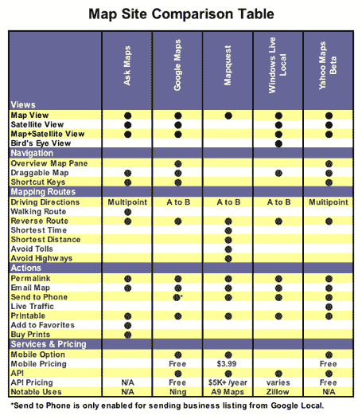
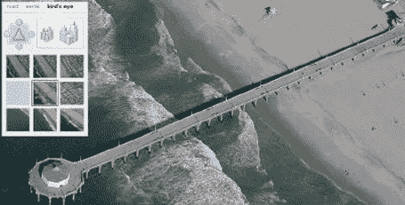
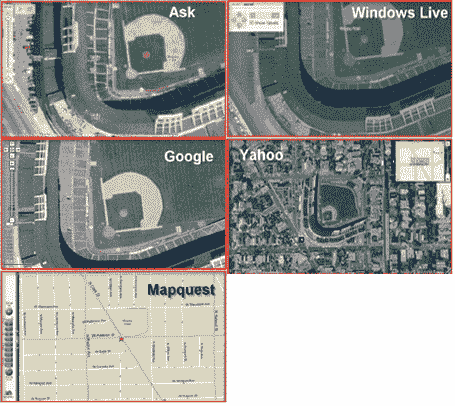

# 比较地图服务 TechCrunch

> 原文：<https://web.archive.org/web/http://www.techcrunch.com:80/2006/04/17/comparing-the-mapping-services>

在线地图在过去的一年里取得了长足的进步。[谷歌地图](https://web.archive.org/web/20221006043442/http://maps.google.com/)进入这一领域，并增加了卫星图像，使其成为焦点——挑战长期地图领跑者 [Mapquest](https://web.archive.org/web/20221006043442/http://www.mapquest.com/) 的彩色卡通式地图图像。Google Maps API 使开发者能够创建新的应用程序和混搭，从而将 Google Maps 品牌推向主流受众。微软、雅虎和其他公司迅速跟进。

尽管谷歌很受欢迎，但它并不是访问量最大的地图服务。它实际上与[雅虎地图](https://web.archive.org/web/20221006043442/http://maps.yahoo.com/)(以及新的[雅虎地图](https://web.archive.org/web/20221006043442/http://maps.yahoo.com/beta)测试版产品，我们在这里评论了[)捆绑在一起。康姆斯克说，谷歌地图三月份有 1910 万独立访客，而雅虎有 2000 万。与 Mapquest 相比，这两家公司都相形见绌，3 月份的独立访客数量高达 4640 万，超过了雅虎和谷歌的总和。](https://web.archive.org/web/20221006043442/http://www.beta.techcrunch.com/2005/11/02/new-yahoo-maps-shows-power-of-flash/)

除了谷歌地图、雅虎地图和 Mapquest 之外，另外两家公司 [Ask Maps](https://web.archive.org/web/20221006043442/http://maps.ask.com/) 和[Microsoft Windows Live Local](https://web.archive.org/web/20221006043442/http://local.live.com/)也提供了引人注目的服务。

我们查看了当前所有五种地图服务，并研究了它们的功能和性能。下面是一个功能的功能比较。

最好的？雅虎地图，原因很多。更多见下文。

## 视图

除了 Mapquest，所有主要的地图网站都提供两种或更多不同的查看选项，包括卫星视图。所有其他网站都有混合视图，将地图信息叠加到卫星图像上。谷歌、Ask 和雅虎也提供纯卫星图片。Windows Live Local 拥有一个更有趣的视图，称为鸟瞰图，它为地图图像添加了一个 3D 维度，这是一个性感的功能，尽管它的价值更多地在于炫目因素而不是可用性:

## 变焦冠军

缩放功能是大多数地图服务中的一个可识别特征。一问，Google 和 Windows Live Local 都并列“缩放冠军”的称号。为了确定冠军，我们执行了一个缩放测试，该测试聚焦于单个地标，并在应用程序允许的范围内尽可能地放大。然后，我们比较了五个缩放级别，看看哪个应用程序允许我们最大程度地放大。因为一张图胜过千言万语，所以看看我们下面的结果。

## 用户界面和功能

雅虎地图拥有获取基本驾驶方向的最佳产品。它的 Flash 界面提供了**多点方向**和**实时交通信息**。想要将路线发送到您的**手机**？点击一个按钮，输入号码，你就有了。雅虎也有一个非常灵敏的界面。考虑到所有这些因素，它最适合个人使用。

Ask Maps 支持多点方向，Mapquest 会将方向发送到你的手机上，但没有其他服务同时提供这两种功能。只有雅虎提供实时交通信息。

Ask Maps 的加载速度似乎比雅虎和谷歌慢一点。Ask.com 确实提供了一个名为“自动驾驶”的显著导航功能，它可以将整个路线动画化。不幸的是，在我们的驾驶方向测试中，Ask.com 是唯一一个提供不准确方向的服务。

使用 Window Live Local，点对点的路线不会像其竞争对手那样用线标记。这使得很难看到实际的路线。相比之下，该服务引入了图钉功能，使观众能够在地图上确定点。这个功能也是一个社交转折，因为感兴趣的图钉点可以通过另一个称为便笺的功能保存并与其他人分享。

## 应用程序接口

提供 API 已经成为一种无价的营销资源。由此产生的 mashup 应用程序提供了免费的市场营销，并围绕 web 2.0 产品进行讨论。撇开 Mashups 不谈，商业应用中的地图解决方案也会有同样的影响。

谷歌拥有最受欢迎的地图应用编程接口，并在许多应用程序中使用，如 [Ning](https://web.archive.org/web/20221006043442/http://www.ning.com/) 、 [CommunityWalk](https://web.archive.org/web/20221006043442/http://www.communitywalk.com/) 等。

谷歌的 API 不是最好的，但它是目前为止使用最多的混搭服务。

预计随着时间的推移，这种情况会有所改变。Yahoo 提供了最广泛的地图开发 API 选择(Flash 和 Ajax)。最近， [Zillow](https://web.archive.org/web/20221006043442/http://www.zillow.com/) ，[用它的模糊数字 Zestimates，整合了 Windows Live Local 通过虚拟地球 API 提供的相对较新的鸟瞰图](https://web.archive.org/web/20221006043442/http://www.beta.techcrunch.com/2006/04/13/zillow-goes-3d/)。

Mapquest 最近还推出了一个开放 API，甚至通过创建开发者挑战[竞赛](https://web.archive.org/web/20221006043442/http://www.mapquest.com/features/main.adp?page=developer_tools_oapi_devchallenge)来激励开发者采取行动。亚马逊的 [A9 地图测试版](https://web.archive.org/web/20221006043442/http://maps.a9.com/)是一个值得注意的 Mapquest 实现，因为它将街道级别的图像与地图上的街道相关联，以产生独特的地图绘制体验。

雅虎是唯一一个可以在网络移动设备上提供地图服务而无需下载的服务。Google Local [Mobile Beta](https://web.archive.org/web/20221006043442/http://www.google.com/glm/index.html) 是一款可免费下载的地图应用，但它并不能在所有移动设备或运营商上运行。 [Mapquest Mobile](https://web.archive.org/web/20221006043442/http://company.mapquest.com/mqws/2.html) 是一种订阅模式，起价为每月 3.99 美元，但能否使用这项服务也取决于您的移动运营商和设备。

## 摘要

Mapquest 是最受欢迎的地图服务，但在功能和可用性上落后。Google 是最著名的，它有一个无处不在的 API。Windows Live Local 以其创造性的视图和功能令人眼花缭乱，但在方向功能方面却不如其他产品。Mapquest 提供了许多功能，但仍然缺少卫星图像，这使它在核心功能上落后于竞争对手。问地图是一个有价值的竞争对手，但有最高的错误率。总的来说，雅虎地图是迄今为止测试过的最好的应用。它的快速 Flash 界面、多点方向、实时交通信息和易于发送到手机的功能使它轻而易举地成为赢家。它还具有最强大的 API 选项。