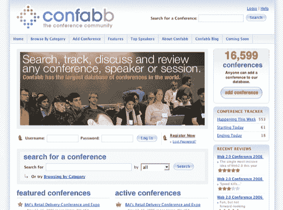

# Confabb:查找、跟踪和回顾会议 TechCrunch

> 原文：<https://web.archive.org/web/http://www.techcrunch.com:80/2006/11/13/confabb-find-track-and-review-conferences/>

# Confabb:查找、跟踪和审查会议

 [Confabb](https://web.archive.org/web/20230124064551/http://www.confabb.com/) 是今天推出的一项新服务，它提供了一个集中查找各种会议信息的地方。通过与 Flickr 的集成，该网站提供了从演讲者和事件评论到事件发生后的照片的所有内容。这是一个令人印象深刻的全面服务网站，至少可能成为科技会议与会者和更广泛受众的首选。

Confabb 由前 PubSub 联合创始人 Salim Ismail、产品经理 Cameron Barrett(他顺便为韦斯利·克拉克和约翰·克里建立了竞选网站)和前美国电话电报公司高管兼 PubSub 团队成员 Jon Mandell 领导。早期投资者包括长期与会者和网络创新者戴夫·温纳。

在发布时，该网站包括 16，000 多个会议的详细信息，任何人都可以填写表格提交其他活动供考虑。Confabb 自称是世界上最大的会议数据库。这是一个非常好的网站；既有标准的类别和标签，整合场外资源，声誉管理，用户观察页面跟踪许多事件，徽章生成器张贴会议标志在您的博客和 iCal 导出您的会议列表。与会者和观察者可以公开展示自己。

Confabb 计划在未来两到三个月推出许多新功能，包括集成更多日历程序、视频和播客列表、每次会议和每次会话的网络聊天室以及本地和集成 RSVP 功能。这是一个雄心勃勃的路线图，但其中大多数功能看起来像是科技行业的最佳实践，每次都集中在一个地方，至少我们的行业最终广泛熟悉了它们。

Confabb 能够在 Web 2.0 世界之外获得牵引力吗？如果像[全亚洲食品博览会](https://web.archive.org/web/20230124064551/http://www.confabb.com/conferences/1426/details)和[第二届国际多丽丝·莱辛会议](https://web.archive.org/web/20230124064551/http://www.confabb.com/conferences/13342/details)这样的活动的与会者开始使用 Confabb，那么活动世界真的会被震动。在最有准备的社区之外建立系统的使用将需要一致的努力，并且可能需要一些改变来适应其他会议社区的文化。

有一些技术上的东西 Confabb 仍然可以使用。非常需要按类别对事件进行 RSS 订阅。该公司表示，微格式正在考虑中，这将有助于证明 Confabb 是一个社区参与者，而不是试图成为一个独家目的地网站。与场外资源的整合非常好，我想看看玛丽·霍德的演讲者维基，这是一个旨在帮助丰富会议演讲者名单的维基，也来自。服务 [Attendr](https://web.archive.org/web/20230124064551/http://attendr.com/) 探索的地图和与会者标签功能也会很有趣。

是时候有人从与会者和支持网站开发的整个网络中获取最佳实践了。Confabb 将许多不同的服务整合在一起，这很棒。这个项目应该会得到很多支持，我希望至少网络世界，如果不是更大的会议世界，会更多的使用 Confabb。
