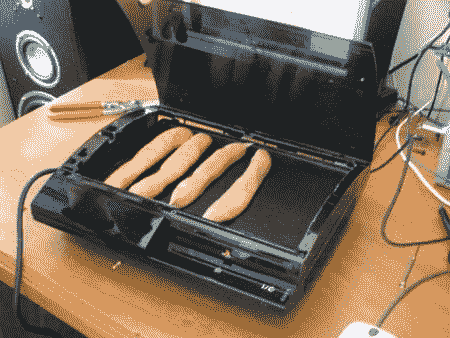

# 游戏机故障率:索尼和任天堂的胜利

> 原文：<https://web.archive.org/web/http://techcrunch.com/2007/07/05/console-failure-rates-sony-and-nintendo-for-the-win/>

根据 EB Games 和 Best Buy 的一些人的说法，大约每三个 Xbox 360 中就有一个因硬件故障而被退回，约占 33%。而 Wii 和 PS3 几乎没有问题，只有 1%的系统出错。结果显然有点粗略，因为这两个系统的市场渗透率和可用性都很低，但这些数字将会给粉丝们一些值得夸耀的东西。

Xbox 360 *已经被*公认为最可靠的主机，所以索尼和任天堂阵营的每个人都应该对这个消息有所保留。

[故障率:Xbox 360 高达 33%–索尼 PS3 &任天堂 Wii 不到 1%](https://web.archive.org/web/20160419235854/http://www.ripten.com/2007/07/03/failure-rate-xbox-360-high-as-33-sony-ps3-less-than-1/)【Ripten】