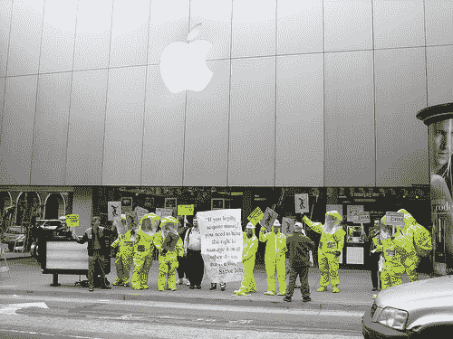

# 消费者权益组织讨厌苹果的 iPhone 电池更换计划

> 原文：<https://web.archive.org/web/http://techcrunch.com/2007/07/06/consumer-advocacy-group-hates-apples-iphone-battery-replacement-program/>

 
没有根基

苹果公司的 80 美元 iPhone 电池更换计划已经颠覆了消费者和纳税人权利基金会，这是一个非营利性的消费者监督组织。我喜欢称他们为爱管闲事的人。该基金会不喜欢苹果收取 80 美元来更换电池，也不喜欢苹果直到设备上市后才宣布任何电池更换计划。我更倾向于对后者而不是前者感到不安:更换电池肯定要花一些钱，但苹果不需要等到人们已经买了手机才放弃这个消息。如果不是完全不诚实的话，也只是不够直率。

该基金会做了一些数学计算，发现普通消费者每 10 个月就需要更换一次 iPhone 的电池。所以，600 美元的手机加上每 10 个月 80 美元 iPhone 真的值得这样的投资吗？如果有人卖给你一辆车，并对你说，你知道，你必须每 10 个月更换一次发动机，这将花费你 2000 美元，你会怎么办？

[投诉](https://web.archive.org/web/20141016042108/http://tctechcrunch2011.files.wordpress.com/2007/07/iphoneltr6-29-07.pdf)(PDF)[消费者和纳税人权利基金会通过 [Macworld UK](https://web.archive.org/web/20141016042108/http://www.macworld.co.uk/news/index.cfm?RSS&NewsID=18482) ]