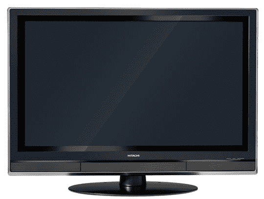

# 竞赛:结束佩特 Obsoletis 的祸害，赢得一台 42 英寸电视

> 原文：<https://web.archive.org/web/http://techcrunch.com:80/2007/06/11/contest-end-the-scourge-of-pater-obsoletis/>

更新:我们现在在这里[投票](https://web.archive.org/web/20160327084225/http://crunchgear.com/2007/06/13/pater-obsoletis-you-guys-came-through-and-dads-everywhere-are-happier/)选出获胜者。请访问并投票！

读者们，拿出你们的莎莉·斯特拉瑟斯假发吧，因为我们将要结束我们美丽土地上的一个主要疫病:*佩特·奥博莱斯蒂斯*。父亲遗忘症是一种消耗大脑的疾病，它鼓励父亲、父亲以及一般男人拥有、购买和使用已经过时的设备。我们想通过制作一些公益广告让世界关注这个问题。

你能帮上什么忙？制作一个 2 分钟的视频，解释你当地患有眼疾的男性的困境:他是谁？他还用什么？他的手机有多旧了？将它上传到一个标签为“OBSOLETIS”的视频共享服务，并在 crunchgear dot com 上向我们发送它的链接。这不一定是你的父亲，确切地说，只是一个无可救药地陷入过去的男人的例子。记住——我们是在努力帮助这些可怜的人，而不是嘲笑他们。善良，温柔，善解人意。

你能赢什么？日立 42 英寸等离子高清电视怎么样？不再过时，佩特！

没错。日立公司的好心人捐赠了一台全新的 [P42H401](https://web.archive.org/web/20160327084225/http://www.hitachi.us/tv/browse/plasma/plasma/P42H401.shtml) 等离子电视来对抗阿宝，正好在父亲节那天发货。太棒了，不是吗？这里有一点关于电视。

> 日立 50 多年的电视经验、制造技术和图像处理技术在 42 英寸 HD1080 等离子高清电视中完美融合。日立使用专有技术重新定义高清晰度，无论输入类型或分辨率格式如何，都能提供出色的图像质量。它的时尚外观设计和超薄底部扬声器有助于 42 英寸面板在时尚和画质方面脱颖而出。日立的 P42H401 采用独特的 HD1080 分辨率，具有 1，000 线的分辨率，与 720p 分辨率的面板类似。日立 42 英寸 HD1080 等离子高清电视是可及的奢侈品。

那么规则是什么呢？您必须在下周三(美国东部时间 6 月 13 日中午)之前提交视频。它必须少于 2 分钟，并且必须提到“佩特 Obsoletis ”,以确保你不只是在使用你 2001 年的大三视频项目。你不必使用花哨的相机——网络摄像头就可以了——但创造力和酷是关键。

我们将在 6 月 13 日公布决赛选手，我们将投票到美国东部时间 6 月 15 日下午 5 点，希望幸运的获胜者能在那个周末拿到电视。

概括一下:制作一个 2 分钟的视频。把它上传到 YouTube 或者 Revver 或者其他什么网站，加上“OBSOLETIS”的标签，然后给我们发一个链接。等等。投票。获得免费电视。

特别感谢日立公司与我们合作举办这场精彩的比赛。祝你好运，感谢你的支持，帮助消灭这种可怕的疾病。