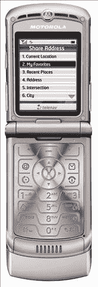

# TeleNav“分享您的位置”竞赛获奖者| TechCrunch

> 原文：<https://web.archive.org/web/http://techcrunch.com/2007/07/17/contest-share-your-location-with-telenav-gps-navigator/>

# TeleNav“分享您的位置”竞赛获奖者

嗨，伙计们，早在 7 月 6 日，我们就结束了 TeleNav 的 GPS 导航服务竞赛，授予两位幸运的读者[一个蓝牙 GPS 接收器](https://web.archive.org/web/20130628164836/http://www.telenav.com/products/tn/btgps/)和[三个月的 TeleNav 服务](https://web.archive.org/web/20130628164836/http://www.telenav.com/products/tn/)。人们进来了。我们选出了获胜者。然后我们很快就忘了提及获胜者。我们的错。

你可能还记得，比赛涉及到如何创造性地使用该服务的位置共享功能。第一名是罗布·d，他去年参加了一场越野摩托车比赛，他认为 TeleNav 可以完美地监控大约 30 名参与者。

> 有了这项服务，其他人就可以看到我们 30 个人在全国的分布情况，谁领先，谁落后，等等。此外，如果有人抛锚，他们会更容易被发现，如果有人在晚上被困在路边，这可能是救命的。

第二名获胜者是 Shayna F。她建议将这项服务用于我们在 CG 最喜欢的消遣之一:把它贴在人身上！

> 饶广大群众多一句“抵制大油，XX 日不买气！”垃圾邮件 err 电子邮件；让我们分享我们的位置和汽油价格，开始一场革命吧！

感谢所有参与的人和 TeleNav 的奖品。现在，看看我们的新比赛。