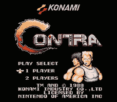

# 魂斗罗无死亡飞车| TechCrunch

> 原文：<https://web.archive.org/web/http://techcrunch.com/2007/05/21/contra-no-death-speedrun/>

这个视频中的一个家伙一路玩着《魂斗罗》毫无疑问是一个 [speedrun](https://web.archive.org/web/20150919045324/http://en.wikipedia.org/wiki/Speedrun) ，但是我还是要感谢他花时间玩它并一路玩完《魂斗罗》。我的意思是玩最初的 NES 版本*和*[Konami 代码](https://web.archive.org/web/20150919045324/http://en.wikipedia.org/wiki/Konami_code)已经够难的了，但是试着不失去一个没有代码的生命？纯粹的疯狂。无论如何，xxxxRothxxxx 有一些严重的 NES 技能。点击下面的链接，见证兰斯(或比尔)像[约翰·兰博](https://web.archive.org/web/20150919045324/http://youtube.com/watch?v=yE8Zukeb6bQ)一样射击眼前的一切。

[《魂斗罗(NES)——没有死亡奔跑](https://web.archive.org/web/20150919045324/http://www.gametrailers.com/umwatcher.php?id=66669)【游戏预告片】