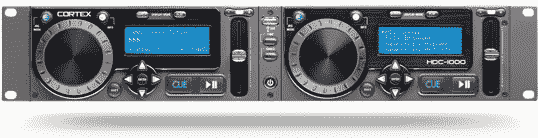

# Cortex HDC-1000 

> 原文：<https://web.archive.org/web/http://techcrunch.com/2006/08/22/cortex-hdc-1000/>

# 皮质 HDC-1000

HDC-1000 是世界上首款双数字音乐控制器之一，可以从外部 USB 设备处理音乐文件，使 DJ 和其他用户可以轻松传输他们的音乐收藏。HDC-1000 提供了智能音乐数据库管理系统，允许用户通过明亮的 LCD 播放屏幕立即找到他们正在寻找的曲目，该屏幕显示艺术家、曲目、标题、已用时间和剩余时间信息。这里更有趣的一个功能是，HDC-1000 可以连接多达四个外部设备，无论存储空间有多大，或者有多少首歌曲上传到设备上，这些功能都不会变慢。HDC-1000 消除了现场 PC 混音的需要，并且可安装在机架上。想象一下，DJ 们:49999 便士的预购价不会再有被盗或损坏的电脑。

[HDC-1000](https://web.archive.org/web/20130627210742/http://www.cortex-pro.com/hdc_1000.php?t=1) 【产品页面】