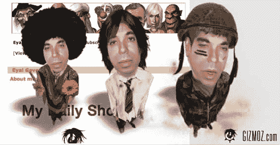
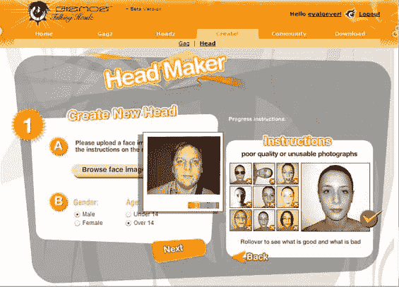
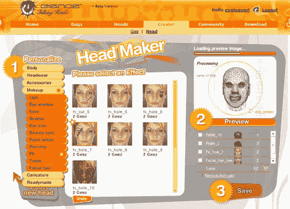
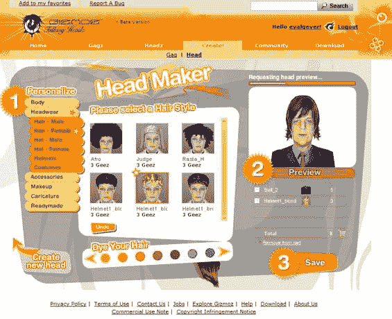
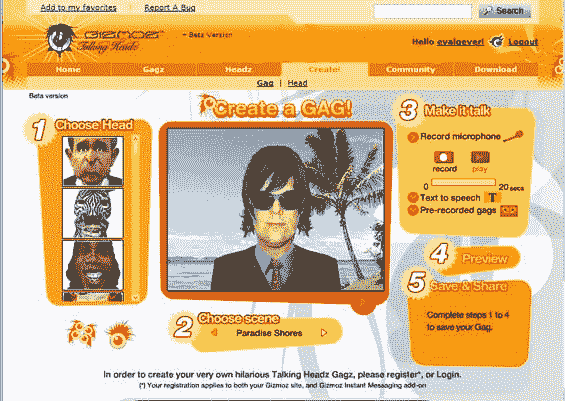

# gizmoztechcrunch 的疯狂 3D 头像

> 原文：<https://web.archive.org/web/http://www.techcrunch.com:80/2006/12/21/crazy-3d-avatars-from-gizmoz/>

  几个月前，在帕洛阿尔托的[以色列网络之旅](https://web.archive.org/web/20221006010619/http://www.israelwebtour.com/)大会上，我第一次见到了 [Gizmoz](https://web.archive.org/web/20221006010619/http://www.gizmoz.com/) 的创始人 Eyal Gever。那天晚些时候，我在旧金山的 Web 2.0 峰会上再次见到了 Eyal。这一次他正在给一群福克斯互动的人做演示(在走廊中间)，包括他们的 M & A 团队。我旁听了演示，演示持续了半个多小时，福克斯的人问了一个又一个问题。

这就是他们感兴趣的原因。Gizmoz 有一个基于 Flash 的 3D 化身产品，它是由一个人的单幅照片加上他们录制的声音制成的。[看看 Eyal 的 MySpace 页面](https://web.archive.org/web/20221006010619/http://www.myspace.com/eyalgever)，里面有一个内嵌的 Gizmoz，你就会明白为什么这会让 SitePal 和其他人在这个领域所做的事情相形见绌。

用户首先上传自己或宠物的照片。Gizmoz 将图片变成 3D 模型(见右图)，然后可以用身体、衣服、效果(伤疤、纹身等)定制头像。)和背景。然后你记录一条信息和声音效果，你的虚拟形象就创建好了。最终的结果是当你说话时有一个移动的嘴和面部表情，效果相当惊人。埃亚尔称之为“把皮克斯带给人们”

这是他们用我的照片制作的几个视频——见这里的[和这里的](https://web.archive.org/web/20221006010619/http://www.gizmoz.com/video/283990_techcrunch)和[和](https://web.archive.org/web/20221006010619/http://www.gizmoz.com/avatar/284222_michael)。我想嵌入这些，但它们会自动播放，人们会不高兴。此外，为蹩脚的音频道歉，这是在 Web 2.0 的走廊上完成的，当时我被 Fox 团队包围着。但是我想通过几分钟的设置展示 Gizmoz 可以做什么。

个性化头像产品仍处于私下测试阶段。该网站上的现有产品需要使用库面，但可以定制和添加个人声音。这些头像可以嵌入到网站中，Gizmoz 也有一个可下载的应用程序，可以将这些头像添加到所有主要的即时消息服务中。

我的空间会为此疯狂的。下面很多截图。

