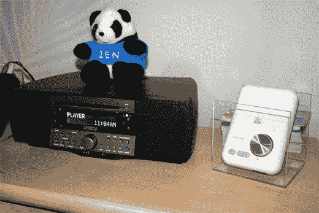

# 创意 XDock Wireless 

> 原文：<https://web.archive.org/web/http://techcrunch.com/2007/01/10/creative-xdock-wireless/>

X-Fi 是一项技术，用于提高标准信号源(包括 MP3 播放器和流媒体信号源)的音频质量。他们已经将这项技术植入了一系列无线设备中，包括 XDock 无线基座和 X-Fi 无线接收器。将 iPod 插入 XDock，就可以通过光学或 RCA 接收器播放音乐。然后，您可以将音频传输到另一个房间的无线接收器。接收器售价 99 美元，iPod 的 XDock 售价约为 199 美元。这个包裹大约要 300 美元。

似乎是在房子里传播音乐的好方法。

[新闻稿](https://web.archive.org/web/20150925092242/http://biz.yahoo.com/prnews/070108/sfm096.html?.v=66)