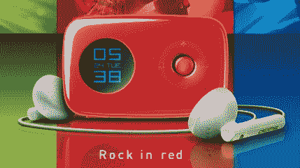

# 创意禅石 Plus: 2GB iPod Shuffle 崇拜者

> 原文：<https://web.archive.org/web/http://techcrunch.com/2007/06/21/creative-zen-stone-plus-2gb-ipod-shuffle-wannabe/>

对创意来说是好事，在最初宣布后不到两个月就推出了对其[禅石](https://web.archive.org/web/20150927235047/http://crunchgear.com/2007/05/03/creative-zen-stone-now-in-six-rocking-colors-for-rocking-out-to-rock-roll/) DAP 的更新。此次升级增加了一个小有机发光二极管屏幕，并将存储容量增加了一倍，达到 2GB，被命名为 Zen Stone Plus。其他好东西包括内置调频调谐器和录音机。每个人都开心！可惜这里没有列出来。

我敢肯定 Creative 想用这个和 iPod shuffle 一战，它这么小，而且有这么多很酷的颜色，但是让 shuffle 如此吸引人的夹子却找不到了。当我听 C + C 音乐工厂的时候我应该把 ZS+放在我的口袋里吗？不，谢谢你。除非我能在切尔西闲逛的时候把我的 DAP——请注意，从盒子里拿出来——别在我的皮背心上，否则我不会感兴趣。

[产品页面](https://web.archive.org/web/20150927235047/http://www.creative.com/products/product.asp?category=213&subcategory=214&product=16696)【创意 via[epiZENter.net](https://web.archive.org/web/20150927235047/http://www.epizenter.net/news.php?extend.294)