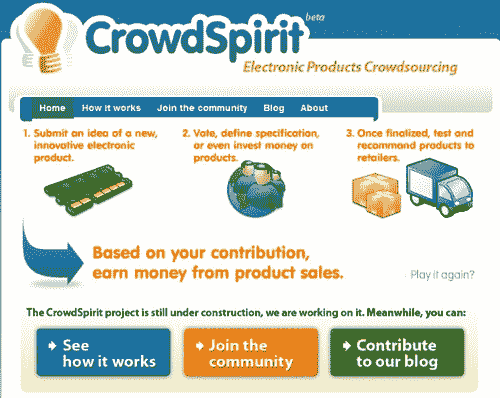

# 众包消费电子| TechCrunch

> 原文：<https://web.archive.org/web/http://techcrunch.com/2006/11/28/crowdspirit-crowdsourcing-consumer-electronics/>

在过去的几年里，混合文化的兴起已经开始渗透到硬件设计和消费电子产品中。SQUID Labs、O'Reilly 的 MAKE、Neil Gershenfeld 的 Fab、开源项目，如 TuxPhone、Greenphone，以及 Sony 等公司的衰落，都为向消费者开放设备的设计和规格提供了新的可能性。特别是开源手机，提供了绕过移动行业创新的人为障碍的可能性。

苏格兰-法国初创公司 [*Crowdspirit*](https://web.archive.org/web/20151220092430/http://www.crowdspirit.org/) ，正寻求利用这些发展趋势，帮助消费者“搔自己的痒处”。该服务让会员提交想法和项目，合作定义规格，如果他们愿意，投资真金白银，并最终购买他们想要的产品。

由于这项服务尚未开放注册，尚不清楚 Crowdspirit 的协作工具有多复杂，也不清楚制造或供应链的灵活性和成本效益如何。然而，这一概念很有吸引力，并在消费者和生产者之间创造了一个有价值的中介，在这个市场中，消费者几乎没有影响力，可能会分享共同创造的价值。另一方面，我们*可能*以一代[以荷马为中心的](https://web.archive.org/web/20151220092430/http://images.google.com/images?q=homer%20car&sourceid=ie7&rls=com.microsoft:en-US&ie=UTF-8&oe=UTF-8&sa=N&tab=wi)产品告终…

我只希望他们能及时发布，让传言中的 iPod 手机满足每个人的预期愿望；)