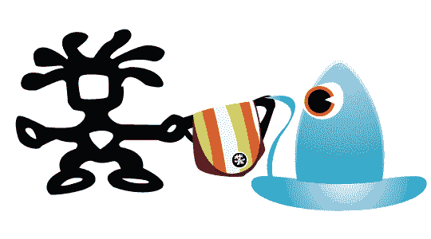

# Crumpler 极客旅行大赛结束| TechCrunch

> 原文：<https://web.archive.org/web/http://techcrunch.com:80/2007/03/26/crumpler-geek-travel-contest-concludes/>

抱歉，我没有像承诺的那样在周五宣布这件事。在过去的几天里，一个链球菌性咽喉炎的恶性病例一直困扰着我。不管怎样，我知道现在很晚了，但我相信你们都想知道谁是我们 Crumpler 极客旅行大赛的最终赢家。

请记住，我们的每位获奖者将从三个 [Crumpler](https://web.archive.org/web/20150820041530/http://www.crumplerbags.com/) 包中任选一个，价值高达 120 美元。那么周五谁赢了？

我很高兴宣布 Tricia 是周五的冠军。恭喜你。

今天晚些时候，我会联系所有获奖者，讨论他们的奖金。感谢大家的参与。

别忘了去拜访一下 [Crumpler](https://web.archive.org/web/20150820041530/http://www.crumplerbags.com/) ，感谢他们慷慨地向我们古怪的小读者回应:极客旅行版贡献了他们的精美商品。