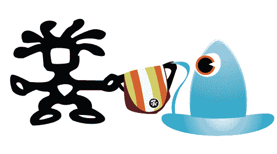

# Crumpler 极客旅行大赛更新

> 原文：<https://web.archive.org/web/http://techcrunch.com:80/2007/03/21/crumpler-geek-travel-contest-update/>

比武第二天！我们将在今天晚些时候宣布第一个获胜者。我对目前为止的评论很满意，我知道他们会越来越好。

对于那些刚刚收听的人来说，我肯定你想知道我到底在说什么:

从现在到周五，我们将送出三个[压皱袋](https://web.archive.org/web/20160420231002/http://www.crumplerbags.com/)，每个价值高达 120 美元。你可以选择你自己的包。如果你不熟悉 Crumpler，是时候了解这个程序了。Crumpler 制造了这个星球上最好的包包。它的包装几乎是不稳定的，质量绝对一流，注重细节。

现在你知道什么是在线的了，这是规则。我们将密切关注这些评论，直到美国东部时间周五下午 5 点。从现在到那时，三个最聪明、最有趣、最有洞察力、最有说服力的评论者将获得一个他们自己选择的 Crumpler 包(最高 120 美元，我已经说过了)。请确保使用您的电子邮件地址登录评论者信息。没有有效电子邮件的评论将不予考虑。

在接下来的几天里，我们会时不时地宣布获胜者。别忘了去拜访一下 Crumpler ,感谢它慷慨地为我们古怪的小读者回复贡献了它的精美商品:极客旅行版。