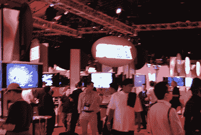

# E3 2007 年总结

> 原文：<https://web.archive.org/web/http://techcrunch.com/2007/07/16/cruncharcade-e3-2007-conclusions/>

好了，一周过去了，我们有时间考虑今年的电子娱乐博览会。大约 24 家公司展示了数百款游戏，推出了新的硬件，大多数与会者可能花了太多时间在穿梭巴士上或堵车上。所以回过头来看，什么可行，什么不可行，以及 ESA(娱乐软件协会)应该做些什么来为明年创造一个更好的节目。

 自从 E3 1999 年回到洛杉机后，这个节目的规模几乎每年都在增长，现在它经历了最彻底的变化。今年的 E3 没有在巨大的洛杉矶会议中心举行，而是分布在圣莫尼卡的几家酒店和其他场所。这被认为是一个更亲密的表演，事实上，较小的场馆确实更容易看到比赛，但没有一家酒店足够大，可以容纳一切。因此，它仍然很拥挤，各种东西都要排队，感觉一点也不亲密。

这也意味着要去很多不同的地方，包括圣莫尼卡机场。因此，每天都有数小时浪费在旅行时间上！但是由于今年没有任何主要的硬件平台，E3 2007 至少是真正的关于游戏的。

**E3 2007 年的亮点:**
*得益于更小的场馆和更合理的观众规模，新闻发布会组织得更好。微软、任天堂和索尼抓住了关键点，没有一家公司表现出让这些事情无法忍受的傲慢程度。

*会议室实际上大小适中，观看一天的比赛并不意味着持续一周的剧烈头痛。音量控制是今年的关键，它带来了舒适的体验。

*小型展览非常适合中型出版商。在过去，艺电和动视与索尼、任天堂、SEGA 和微软一起主导了展会。像 THQ、中途岛、育碧和科乐美这样的出版商真正受益于没有被业内最大的几家公司垄断。

**2007 年 E3 的低谷:**
*较小规模的演出确实把小家伙们冷落了。虽然主要出版商的竞争环境是公平的，但许多较小的出版商却不存在。同样，肯蒂亚大厅的人群也没有一个贸易展览来展示他们的商品。这听起来可能是一个小问题，许多与会者几乎没有花时间去参观“地下室”层的肯蒂亚厅，但对于赛德克和 CDV 这样的公司来说，这一层是他们的家。这些公司在消费电子展或纽约北美玩具展的人群中会更加迷失。那么留给他们的是什么呢？全民 E 秀？

*与洛杉矶市中心相比，圣莫尼卡的分散位置是一个受欢迎的变化。感受太平洋的微风真是太棒了。但是在坐了 40 分钟的公交车去三英里后，所有那些积极的感觉都消失了！很明显，E3 的组织者想在两家附近的酒店举办这场演出，但是演出越来越多，结果它太分散了。许多与会者抱怨说，几乎不可能安排会议，也完全不可能看到一切。

*Barker Hanger 有些好东西。它很小，但它是可管理的。尽管有人认为“五分钟就能完成”，但这完全是错的。事实上，Barker Hanger 最大的不足之处在于，它与众不同，以至于许多参与者从未去过。许多游戏只在衣架上展示。这是一场失败，对所有人都是失败。事实上，没有出租车搭载点只会让情况变得更糟。

*无论是谁想出了把新闻发布室建在新闻发布厅旁边的绝妙主意，都应该获得迄今为止最愚蠢行动奖！在游戏演示期间，新闻发布会的声音非常大，以至于你无法在新闻发布室工作，而当新闻发布室实际上很安静时——例如当有人试图只在舞台上说话时——新闻发布室压倒了新闻发布会。

E3 2008 年
如果明年有一个电子娱乐博览会，从街上的话来看，这是一个很大的如果，展会需要重新组织。

*首先，展会组织者需要找到一个合适的场地。要么把节目带回亚特兰大，要么带到拉斯维加斯。甚至试图把它带回洛杉矶会议中心的一个大厅也是可行的。但关键是，它需要在一个单一的屋顶下，新闻发布会和所有。应该还是限于贸易。抱歉粉丝们。我并不讨厌你，但是真的一旦你做了几次这种事情，你就会发现这并不好玩。所以，让媒体、买家和业内人士各显神通吧。我们保证为您报道一切！

*第二，7 月 4 日之后的一周是行不通的。梅怎么了？好吧，这是离假期更近的几个星期，据说给了开发者“额外的时间来磨练游戏”，但展览只是因为酒店被预订而推迟到 7 月吗？人们夏天去度假，他们不喜欢从伦敦飞回来，然后去圣莫尼卡。至少我没有！如果你真的需要额外的时间，考虑十月！

*最后，视频游戏行业需要一个贸易展。电子游戏从来不适合 CES，而且那个展会已经太长了。为索尼、任天堂和微软增加新闻发布会将是一场噩梦。同样，玩具展也不会那么乐意欢迎这些公司。玩具行业精益经营他们的商店，纽约贾维茨会展中心的展厅没有巨大的展位。虽然这看起来很合适，但玩具展和游戏行不通。E3 实际上工作，直到它变得如此之大。精益展示是一种方式，但回到我在这个问题上的第一点，保持小规模。让我们试着把它做好！