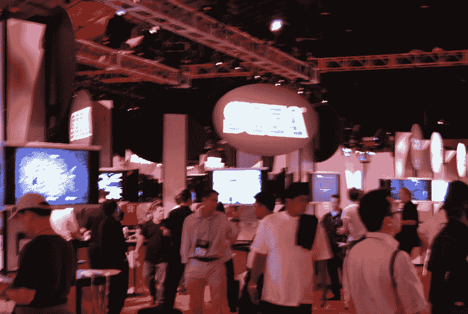
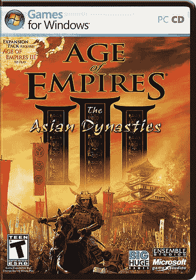
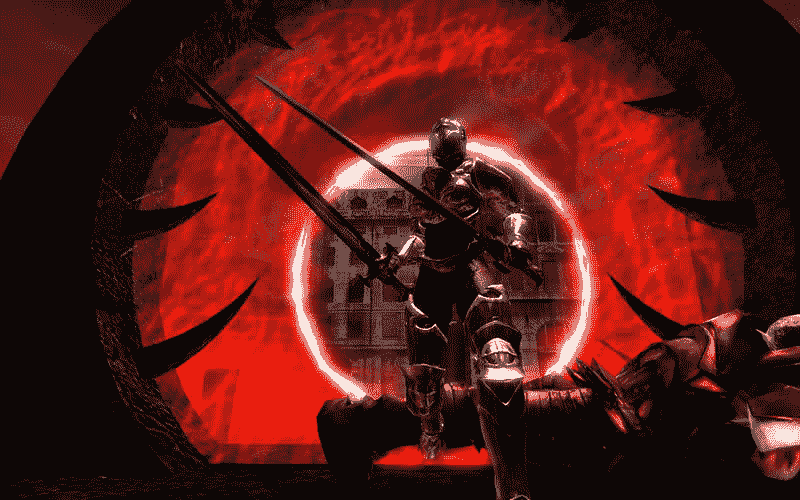
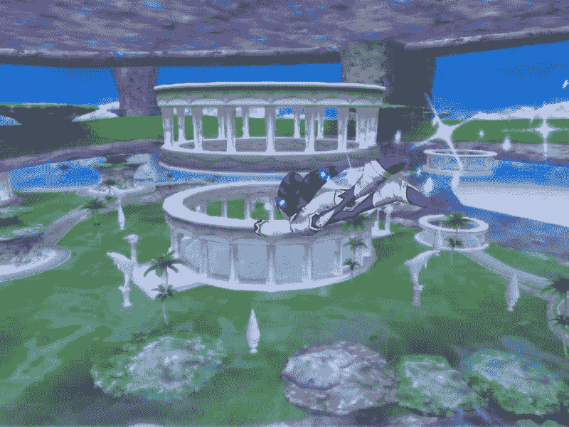
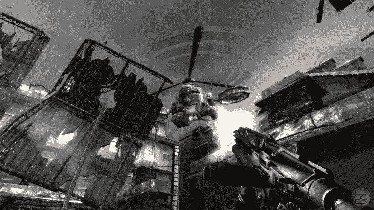
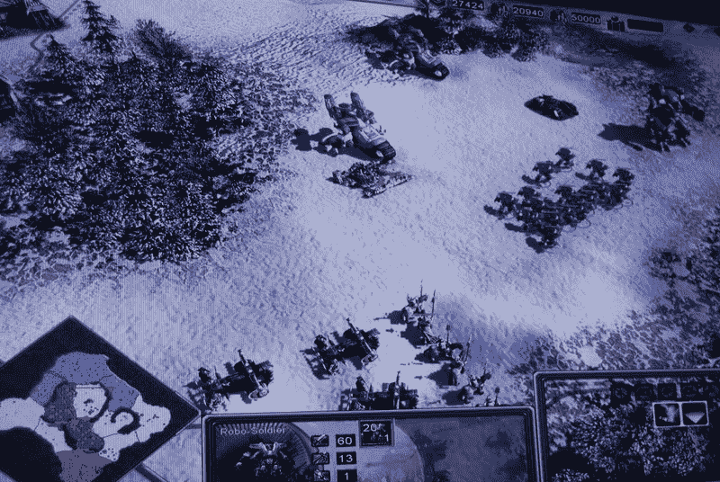

# CrunchArcade:在 Barker Hanger 闲逛

> 原文：<https://web.archive.org/web/http://techcrunch.com:80/2007/07/12/cruncharcade-hanging-out-at-barker-hanger/>

今年的电子娱乐博览会最显著的不同可能是展厅，或者更准确地说，是没有展厅。与洛杉矶会议中心的大型展台、震耳欲聋的音乐和游戏音效不同，今年的“表演场地”是圣莫尼卡机场巴克衣架上的一个单间。它似乎比任天堂或索尼去年的展位小，但尽管尺寸缩小了，仍有一些宝石没有在其他地方展示。

到达衣架也不是一件容易的事，它与阳光和沙滩相去甚远，而那里离展会的主要酒店只有几码远。但也许这并没有让我们分心，而是让我们进入游戏的正题。有趣的是，在 Barker Hanger 展示的标题实际上并没有在许多酒店的会议室里展示，所以这次旅行最终是值得的。突出的游戏包括:

帝国时代 III:亚洲王朝
这个来自微软游戏工作室的附加包是由《国家崛起》的创作者 Big Huge Games 开发的。其结果可能是迄今为止最受欢迎的帝国时代系列的附加组件。顾名思义，这款游戏加入了中世纪晚期远东的各种势力，包括朝鲜、中国和日本。当然，它会加入典型的新单位，所以你会看到武士和忍者以及韩国的“海龟船”在这个即时战略游戏中，欧洲列强仍然可以玩，让你在一些远东帝国主义中一试身手！还有比这更好的吗？不用等到假期才玩吧！

伦敦，你知道炸鱼薯条、欢乐的 Poppins、糟糕的食物、更糟糕的天气……伦敦！好吧，再加上一个恶魔产卵已经接管了，这是地狱之门:伦敦，即将到来的电子艺术 Windows 游戏标题。兼容 DX9 和 DX10 这可能是值得升级到 Vista 的标题，以获得所有的图形荣耀，因为你是最后的抵抗战士之一。在这个假期，你将能够前往 2038 年的伦敦，使用各种特殊的武器和力量来纠正错误。

夜晚
SEGA 因其特许经营品牌而闻名，如 Sonic，但一些长期游戏可能会记得最初的夜晚游戏，当它在近十年前首次为世嘉土星推出时。这部续集讲述了海伦和威尔，两个正常的孩子，进入了被称为“夜乌托邦”的梦幻世界。但这并不都是愉快的梦，因为他们必须帮助夜晚与各种试图控制睡眠世界的夜魔战斗。飞行动作平台以七个多阶段的世界和足够多的彩色拼图为特色，让你在夜晚享受甜蜜的梦。即将到来的这个假期。

时间转移
嗯，这是一个血腥的时刻！但是对于这个第一人称射击游戏来说，等待时间变得越来越短了，这个游戏设定在一个交替的历史中，你必须使用一个特殊的量子时间套装来逆转事件。因此，如果你喜欢“子弹时间”，你会喜欢这种放慢、停止甚至逆转动作的能力。你可以躲避子弹，躲避爆炸，如果第一次没有成功，你甚至可以“重来”。图形也得到了一个甜蜜的制造商，行动和节奏似乎有所改善，因为这一次是在去年的 E3 显示。至少对 PC 和 Xbox 360 来说，等待不会太久。它将在 10 月 30 日到来……但是抱歉，PS3 玩家们，你们必须多一点耐心，因为这款游戏可能要到新年才会发售。即使是量子服也帮不了你！

帝国地球 III
可能最大的惊喜是，在即时战略系列中将会有第三个游戏。好像以前的标题并不完全是成功的热门。但第三次可能是魅力所在，更何况这款游戏的原创者里克·古德曼已经离开了团队。其结果是游戏性的重新聚焦，游戏性仍然贯穿了从石器时代到不久的将来的整个人类时代，但这更像是一个魔兽风格的游戏，而不是真实的历史。结果是没有真正的世界力量，而是三个可玩的派系，包括西方文明，中东文明和远东文明。同样，游戏将增加一个征服世界的战役，这个战役将会把一个地球划分成不同的区域(比如风险),让你随着时间的推移加入到你的帝国中。让征服在今年 11 月开始。