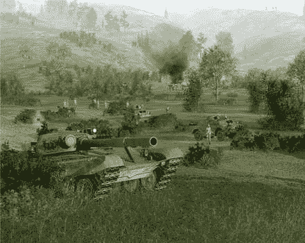
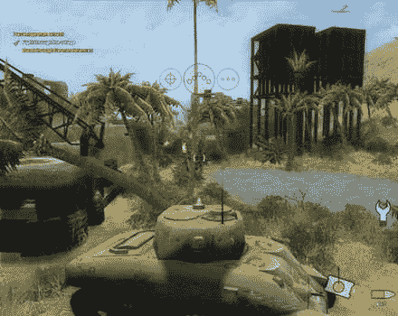
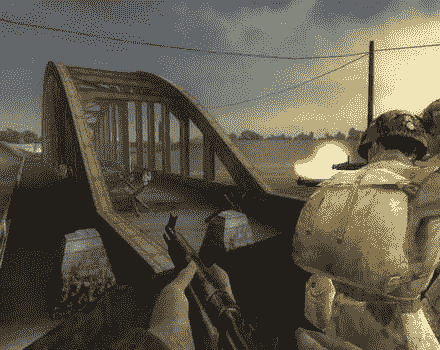
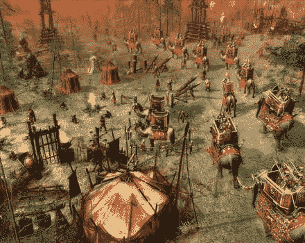
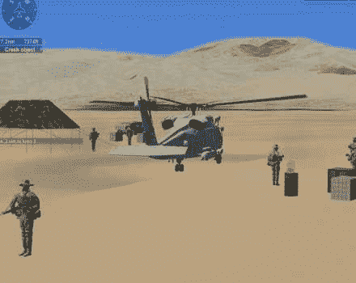
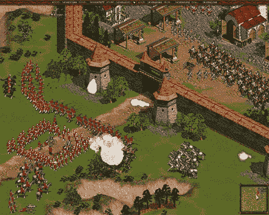
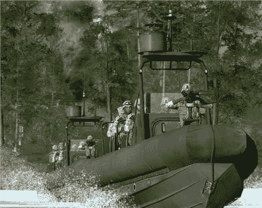
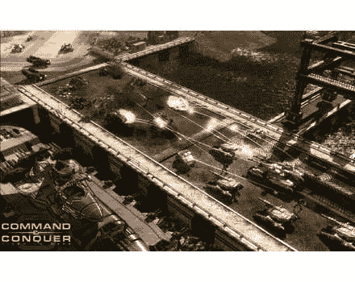
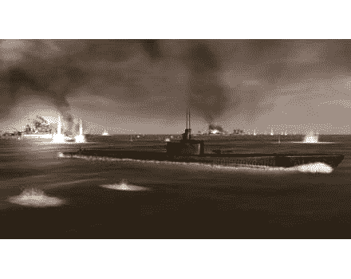

# CrunchArcade:前线的战争模拟

> 原文：<https://web.archive.org/web/http://techcrunch.com/2007/06/06/cruncharcade-war-simulations-on-the-front-line/>

战争是地狱；不可否认。然而冲突为游戏提供了一个很好的背景。虽然即将到来的游戏，如新宣布的*使命召唤 4* 和下一个*战友*还有几个月的时间，你现在就可以开始行动了。今年春天，有几款游戏被忽略了，这些游戏提供了一系列动作。战争游戏不需要局限于第一人称射击游戏。让你扮演“纸上谈兵的将军”的战略游戏同样令人兴奋。是时候锁定和加载，并准备出击。在这个开始解放欧洲的 D 日纪念日(9 年前在*拯救大兵瑞恩*中的一个令人印象深刻的场景)，我们来看看一些将你送上前线的军事模拟人。

***战争的沙丘***
[追梦人互动](https://web.archive.org/web/20130628192057/http://www.dreamcatchergames.com/)
ESRB:青少年
平台:PC
美国加入二战后最早制作的“宣传”电影之一是由汉弗莱·鲍嘉主演的一部名为*撒哈拉*的电影(不要与糟糕的马修·麦康纳同名电影混淆)。在这部电影中，中士乔·冈恩(真的是他的名字)是一名坦克指挥官，在北非沙漠中与邪恶的纳粹作战。这个游戏几乎提供了同样无聊的乐趣。就像很久以前的电影一样,*战争沙丘*毫无意义——但它真的没有必要。你可以驾驶一辆坦克，带领你的部队投入战斗，这足以让一些愚蠢的娱乐。

战争沙丘把简单的事情做对了。人工智能控制的飞机、反坦克炮甚至敌人的坦克挡在你的路上，你必须干掉它们。在一个非常平衡的游戏中，你既可以扮演盟军，也可以扮演轴心国。事实上，这是动力不足的美国谢尔曼在对抗老式德国坦克时表现非常好的地方，比如装甲四型，所以在单人战役中这是一个非常公平的竞争环境，并且在强大的多人游戏模式中也是如此。该游戏包括 10 个多人地图，具有完全可破坏的环境，其中多达 32 名玩家可以穿着二战盔甲参加战斗。

***荣誉勋章:先锋***
[电艺](https://web.archive.org/web/20130628192057/http://www.ea.com/)
ESRB:少年
平台:Wii
听好了士兵！作为精锐的第 82 空降师的一员，你将投入战斗，开始哈士奇行动，西西里的入侵。但不要以为这是意大利度假；有几千精锐的德国军队不会让你这么容易就被征召入伍。也不要认为你会留下来欣赏风景。在意大利之后，你有一个叫 D 日的小事情要处理，然后你将前往荷兰进行市场花园行动，最后在大学行动期间进入德国的心脏。第 82 空降师有相当的欧洲之旅，而*荣誉勋章:先锋*让你从头到尾体验一遍。

这款流行的第二次世界大战第一人称射击游戏的最新版本将让你冒险投入战斗，将欧洲从纳粹魔爪下解放出来。这一款是专为利用 Wii 独特的双手控制器而设计的，在那里你可以跑啊跑，进行直接攻击，或者作为狙击手使用隐形技术，作为盟军先锋的一部分从远处干掉目标！控制比去年的*红钢*更精细，但标准控制器可能仍然是射手的更好选择。然而，从视觉上来说，游戏实际上也提供了商品，任何说 Wii 没有好看的游戏的人都应该看看这个最新的 *MoH* 标题。

***古代战争斯巴达***
[伊多斯](https://web.archive.org/web/20130628192057/http://www.eidos.com/)
ESRB:成熟(血腥、暴力)
平台:PC
古典时代世界更小了，但这并没有让想要成为征服者的人变得更容易！确切地说，你认为亚历山大是如何得到“大帝”这个绰号的这并不是因为他是一个全面的好人；这是因为在战场上打败了波斯人和埃及人。这款战略游戏让你有机会主宰东地中海，在这款视觉效果丰富的实时战略游戏中，你将带领斯巴达、波斯和埃及的军队进行三场大型战役，让你指挥战舰、战车、骑兵和攻城武器。当然，这也不全是征服，你必须利用你的工人来创造繁荣的经济和升级你的防御。

不幸的是，这一切听起来不错，但游戏可能会很乏味。这种建设似乎比当时的一些帝国持续的时间更长，任何尝试传统 RTS“rush”的人都可能会被打败。这主要是因为资源收集非常缓慢。界面也远非流线型。它充斥着你根本不需要的信息，并且使用了一个毫无吸引力的设计。然而动画非常好，这是一个好看的游戏。但公平地说，我宁愿只下载 1998 年的原版《帝国时代》。现在有一个关于古典时代的经典。

***任务:黑鹰***
[算盘](https://web.archive.org/web/20130628192057/http://www.abacuspub.com/)
ESRB:人人
平台:PC
尽管人人 ESRB 评级为 E，但这是一款任何人都不应该玩的战争游戏。这款游戏本质上是一个战斗飞行模拟器，不仅仅是动作，也很简单。虽然你将“驾驶”各种直升机，包括 UH-60L 黑鹰、SH-60 海鹰、HH-60G Payehawk 和 HH-60J Jayhawk，但你永远不会真正感觉到你在飞行。糟糕的图像，不切实际的任务和不稳定的控制只是这一个的基础。这是一架黑鹰直升机，它应该呆在下面！

***哥萨克:皇帝版***
[Take 2 互动](https://web.archive.org/web/20130628192057/http://www.take2games.com/)
ESRB:少年
平台:PC
如果这个听起来很熟悉，那是因为你以前可能甚至玩过它。它最早于 2001 年来自乌克兰游戏开发商 GSC 游戏公司，由 CDV 出版。现在 Take 2 Interactive 已经重新包装了原来的*哥萨克:欧洲战争*游戏以及*重返战争*和*欧洲之战*资料片。这让你在一个军官真正绅士的时代，带领 16 到 19 世纪的主要力量投入战斗。

这是穿着花哨制服的大军排成阅兵队形，然后开始互相攻击的时候。结果是战争史上一些最精彩的战斗，当然也有一些最血腥的战斗。很好地捕捉了这个时代的游戏，显然是受到了帝国时代 II 的启发，事实上，直到帝国时代 III 的到来，这已经是你能得到的最接近的了。但是与 AoE 系列不同的是，*哥萨克*以一些真正大规模的战斗为特色，在那里你可以建立几千人的军队，完成真实时代的精确风格编队。选择方块来抵御骑兵的攻击，或形成线来重击敌人。

地图上有成千上万的单位，游戏比用玩具士兵打仗更有趣。尽管如此，这些动画还是有些乏善可陈，以今天的标准来看已经过时了(甚至是 2001 年)。但是，如果你能看过去的动画，并适应混乱的界面*哥萨克*实际上是一个伟大的游戏，专注于光荣的战斗时代。

***ArmA:战斗操作***
[雅达利](https://web.archive.org/web/20130628192057/http://www.atari.com/)
ESRB:成熟(血腥、暴力、强势语言)
平台:PC
自从*战地 1942* 发布以来，军事射击游戏的大部分焦点都是围绕着多人模式，而不知何故 *ArmA:战斗操作*却完全逃避了关注。如果有一款游戏值得一看，那就是这款。可悲的是，雅达利的困境导致这款游戏几乎被忽略，这是一个真正的耻辱。 *ArmA* 本质上是*行动闪点*的后续，它在 2001 年问世时是一款极其前沿的射击游戏。

这一次你将经历一个 20+任务的单人战役，虽然是线性的，但实际上是根据你完成各种目标的表现而变化的。当然，这款游戏有一个丰富的多人游戏模式，每一方可以支持几十个玩家，地图可以非常广阔和开放。这使得游戏中你希望每队都有很多玩家。作为一个小团队的局域网游戏，你会有问题，因为地图太大了。但在网上，这种规模和范围让人感觉混乱、紧张和困惑——就像真实的事情一样。

游戏中使用的武器、车辆和其他装备的类型也同样真实。东方对西方的主题再次成为背景故事，这意味着你将看到前苏联集团的装备以及美国和北约的装备。这大部分看起来渲染得非常好，除了偶尔的块状人物或混乱的场景， *ArmA* 真的提高了战争游戏的标准。这只是一个遗憾，大多数游戏玩家永远不会注意到。

***命令&征服:泰伯利亚战争***
[电子艺界](https://web.archive.org/web/20130628192057/http://www.ea.com/)
ESRB:青少年
平台:PC、Xbox 360
*命令&征服*并非原版即时战略游戏。这一荣誉将授予来自同一个开发商 Westwood Studio 的《沙丘 2 》,该公司在过去 15 年中为改进这一类型做了大量工作！该公司长期以来一直是电子艺界的一部分，这些年来，这个特许经营权经历了起起落落。每一款伟大的《T21》游戏(包括衍生游戏《红色警戒》系列)都有一些令人失望的地方。

今年春天上市的《泰伯利亚战争》是较好的游戏之一——部分是因为它坚持做自己最擅长的事情。这意味着夸张的游戏性，梦幻般的武器，未来派的技术和不超出 B 级电影范围的情节。同样，这个游戏充满了大量的 B 级人才，包括翠西亚·希弗，乔什·哈洛威，迈克尔·艾恩塞德和比利·迪·威廉姆斯。这给了游戏更多电影史诗般的感觉——至少如果这部电影史诗在周六晚上 12 点在 Cinemax 上映——通过 35+的单人任务。

最棒的是，这款游戏几乎完美地平衡了 RTS 游戏中的“石头、剪子、布”的玩法，因此玩家可以安全地进行冲锋、龟缩、游击或战斗。换句话说(如果你不是一个 RTS 玩家)，你可以很容易地从一开始就攻击或者先积累。如前所述，这部电影没有太多创新，所以它没有给这种类型带来任何新的东西。有些单位有点失去平衡(因此我们说接近完美的平衡)，但除此之外，这是我们一直想看到的坚固的 *C & C* 。

无声猎人 4:太平洋之狼
育碧
ESRB:青少年
平台:PC
“谁是潜艇指挥官？”这是电影*冒险事业*中的一句很棒的台词，我不得不在这里使用它。但答案其实是没有人，至少在这个游戏里没有。广受欢迎的二战潜艇特许经营权已经前往太平洋的深蓝色水域(正如你可能已经注意到的标题)。因此，你不能指挥一艘 U 型潜艇，而只能满足于美国和日本的潜艇。在*无声猎人 4* 中，你还可以驾驶超过 75 台真实时代的战争机器。这也不仅限于潜艇。虽然你可以和美国加托潜艇一起潜水，但你也可以像潜艇猎人一样飞向天空，甚至可以在其他水面船只上巡逻。

这一直是一个爱它或恨它的系列。动作节奏不快，有些游戏会因为你的无声奔跑而拖延。当然，这种爆炸性的时刻确实会发生，但很快也很短暂——就像二战中潜艇艇员的真实经历一样。单人战役有 15 个地图可供探索，此外游戏还提供了一个新的在线对抗模式，你可以在其中狩猎或被狩猎。