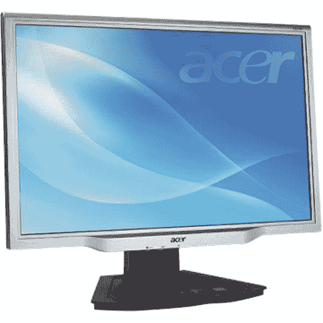

# CrunchDeal:宏碁 22 英寸液晶显示器，售价 199 美元(仅限今日)

> 原文：<https://web.archive.org/web/http://techcrunch.com/2007/08/03/crunchdeal-acer-22-inch-lcd-for-199-today-only/>

就在今天，Staples.com 有一款 22 英寸的宏基宽屏显示器，30 美元即时折扣后售价 199 美元。

它的分辨率为 1680×1050，对比度为 700:1，亮度为 300 cd/m2，响应时间为 5 毫秒，保修时间为 3 年，支持 DVI/VGA 连接。

不到 200 美元还不算太差。只有今天。

[宏碁 AL2216Wsd 22 英寸宽屏液晶显示器【Staples.com ](https://web.archive.org/web/20160422054107/http://www.staples.com/webapp/wcs/stores/servlet/StaplesProductDisplay?PID=361116&jspStoreDir=Staples&cm_ite=Ongoing+-+Staples+Basic&catalogIdentifier=2&SID=FW5jxgos&cm_pla=361116&AID=10462997&cm_cat=358129&cm_ven=CJ&partNumber=692758&storeId=10001)