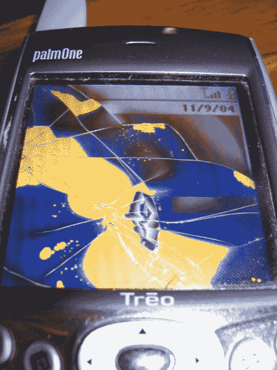

# CrunchedGear 半决赛提醒

> 原文：<https://web.archive.org/web/http://techcrunch.com/2006/08/22/crunchedgear-semi-finals-reminder/>

# CrunchedGear 半决赛提醒

另一个提醒是尽早投票，经常投票给你最喜欢的[嘎吱作响的齿轮](https://web.archive.org/web/20130627205622/http://crunchgear.com/2006/08/22/crunchedgear-semi-finals/)。

 1。
狗吃手机

2.
雷沃解构了
还能用。

3
Mac 卡车
这辆 Mac 无缘无故被一辆卡车轧死了。

4
Treo 被击中
这一枚落在杜勒斯机场。它存活了 30 分钟，直到死去。

嘎吱作响的屏幕
这个特里奥被桌子角直接击中了。