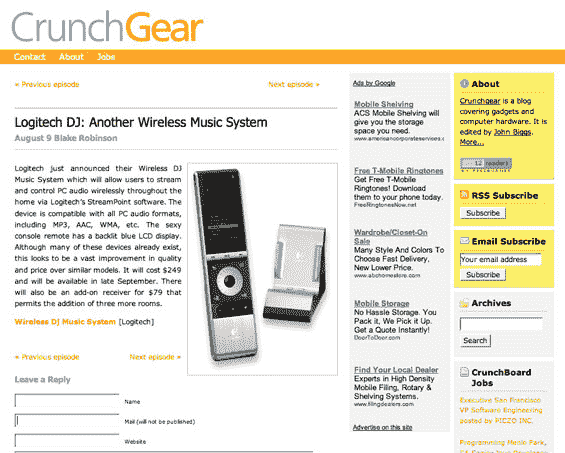

# CrunchGear，专为痴迷于 TechCrunch 的小工具设计

> 原文：<https://web.archive.org/web/http://www.techcrunch.com:80/2006/08/10/crunchgear-for-the-gadget-obsessive/>

# CrunchGear，专为痴迷于小工具的人设计

Crunch 网络今天正在扩张——[Crunch gear](https://web.archive.org/web/20221208230238/http://www.crunchgear.com/)，我们的最新博客，刚刚[在一个闪亮的新服务器上发布](https://web.archive.org/web/20221208230238/http://crunchgear.com/2006/08/10/welcome-to-crunchgearcom/)。CrunchGear 是关于新的小工具、设备和计算机硬件的。我们过去偶尔报道过一些小玩意(Sonos、Eye-Fi、Sony MyLo 和其他产品)，这些观众显然对上市的最新产品感兴趣。

我们请来了一个全新的团队来管理 CrunchGear。编辑是约翰·比格斯(John Biggs)，他之前是 Gizmodo 的编辑。在他的管理下，Gizmodo 的页面浏览量从每月 400 万增加到超过 1200 万。他是一名经验丰富的记者和博客作者，知道如何准确地写下他的读者想要阅读的内容。约翰正在与一个顶级作家团队合作，其中包括创作流行音乐博客 [audiomonger](https://web.archive.org/web/20221208230238/http://www.audiomonger.com/) 的布莱克·罗宾逊。关于团队的更多信息在 [CrunchGear 关于](https://web.archive.org/web/20221208230238/http://crunchgear.com/?page_id=2)页面。CrunchGear 是由伦敦 ThisSideUp 的创始人杰里米·贝恩斯设计的。

CrunchGear 将与其他小工具博客有所不同。该团队致力于撰写突发新闻，但也会在给定类别中进行每周产品比较。期待 CrunchGear 看起来像是介于纯博客和 CNET 评论之间的东西。我们的目标不仅仅是让你知道即将推出的热门新品，还能帮助你决定你想买什么样的相机、笔记本电脑或 MP3 播放器。

每天都有很多新玩意上市，所以预计 CrunchGear 上会有很多帖子。如果你想订阅 RSS 频道，那就去 feeds.feedburner.com/crunchgear 的[网站](https://web.archive.org/web/20221208230238/http://feeds.feedburner.com/crunchgear)，或者你也可以在[主页](https://web.archive.org/web/20221208230238/http://www.crunchgear.com/)注册，接收每日邮件。

CrunchGear 是我们本月的第二次产品发布(上周我们发布了 [CrunchBoard](https://web.archive.org/web/20221208230238/http://www.crunchboard.com/) )。我们还没完呢。在接下来的 30 天里，我们还有两个博客要发布。

