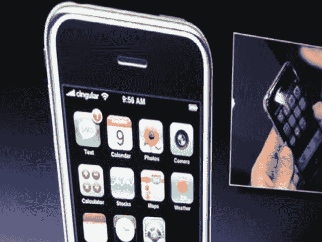

# 2007 年 MacWorld 大会:主题演讲结束了

> 原文：<https://web.archive.org/web/http://techcrunch.com/2007/01/09/crunchgear-macworld-2007-the-keynote-is-over/>

这是 CrunchGear 在 MacWorld 2007 上报道苹果主题演讲的现场文字记录。

* * *

11:00 PST–Iphone 希望在 2007 年改变行业。"我滑向冰球将要去的地方，而不是它已经去过的地方."掌声雷动。传输结束。

晚上 10:58——点击器失灵——问题。
一事无成。拖延——讲述他和沃兹如何制作电视干扰器。是..现在只是转卖。苹果股票刚刚涨了 5.26。他是谷歌/cingular 的首席执行官，也是雅虎的联合创始人。苹果现在是“苹果公司”

太平洋标准时间 10:52——Cingular SEZ:荣幸地与苹果合作——在他们签署合同之前，他们甚至没有看到手机。美国电话电报公司写了一本关于电信的书。

太平洋标准时间 10:50–可从 Cingular 商店和 Apple 商店购买。

太平洋标准时间 10:49–我们将在 6 月 7 日收到。亚洲得到它 08。他们与 Cingular 合作。

10:47 PST–4GB 型号为 499 美元。8GB 型号 599 美元。6 月上市。价格昂贵。

10:46 PST–Iphone 是*您口袋里的生活*成本是…耳机是疯狂的 200 项专利先进的艺术状态

太平洋标准时间 10:44–新耳机..内置麦克风和麦克风开关。新蓝牙。从今天起，人们不会再以同样的方式看待手机了。

太平洋标准时间 10:40–实时照片编辑和发送。多任务处理。

10:38 PST–网络上最伟大的两家公司，经济特区乔布斯。雅虎和谷歌同台？奇怪。

晚上 10:37——杨致远上场——雅虎+苹果。雅虎 Go-邮件和搜索。垃圾邮件防护。没有交换服务器的黑莓。

太平洋标准时间 10:34——苹果和谷歌首席执行官施密特就合并开玩笑——苹果咕。Google+苹果设备的传闻？雅虎搜索

太平洋标准时间 10:32–谷歌地图我真的很喜欢它。搜索，拨打某个地方很容易，卫星图像可以显示

太平洋标准时间 10:29——乔布斯恶作剧打电话给星巴克。

太平洋标准时间 10:27——苹果公司股价在消息公布后上涨了 2.50 美元。

10:26 PST–可以有多个网页..暴露/仪表板样式。拉德。

太平洋标准时间 10:24–像往常一样阅读电子邮件。双击可放大网页上的任何位置..也会缩小你。

太平洋标准时间 10:22–完整的桌面课程电子邮件。Safari 在上面看起来很热。他通过无线网络下载纽约时报。

太平洋标准时间 10:20–电子邮件显示非常好。富文本。可以按下显示在任何地方的电话号码，自动呼叫一个地方。

10:18 PST–Widgets、google maps、safari(全 html)可以在检测到时自动切换到 wifi。丰富的 HTML 邮件。将从雅虎免费推送 imap 邮件。小部件。

10:17 PST–通过“挤压”图像来放大和缩小

太平洋标准时间 10:16–是短信。屏幕键盘。看起来像 ichat。

10:14 PST–SMS 看起来像 ichat。

太平洋标准时间 10:13–蒂姆·库克的语音邮件–收入结果。阿尔·戈尔来电？

太平洋标准时间 10:10——显然没有 3G。

太平洋标准时间 10:08，乔布斯打电话给 iPod 的创始人乔恩·艾夫斯。创建带触摸屏的会议呼叫。

太平洋标准时间 10:05–黑仔 app 正在拨打电话。与 Mac 或 PC 同步。四频 GSM + EDGE。蓝牙，WiFi。短信。随机接入语音邮件。

太平洋标准时间 9:57–通过滑动屏幕解锁手机。选择披头士 ITUNES 上的披头士。类似仪表板的界面。拉吉·赛兹:伙计，这是我见过的最酷的手机。触摸屏就像橡皮筋。橡皮筋，拉吉？

太平洋标准时间 9:56–4089961010–这是什么？接近传感器！把它放到面前，屏幕就会自动关闭。横向或纵向模式。辛古拉拿到了。对图像使用 coverflow。数字是苹果销量#。

太平洋标准时间 9:54–3.5 英寸触摸屏。1 个按钮。电话按钮。比他们都瘦。3.5 英寸。每英寸 160 像素。一个 home 键。11.6 mm 薄。背面有 2mp 摄像头。耳机插孔在顶部。SIM 卡插槽。底部有麦克风。ipod 接口。手机内置 3 个传感器
。当你举起它来接听电话时，它会自动关闭触摸。
200 万像素摄像头。全球通。睡眠唤醒开关。

9:53 PST–通过 itunes… ical、地址簿进行同步。8GB 存储。

9:50 PST–Raj SEZ:Iphone 运行 osx！它可以运行真正的桌面级应用。和网络。

太平洋标准时间 9:49–多指手势。”“那么我们如何把它带到移动设备上呢？去掉所有按钮，只做一个巨幕。那我们要怎么交流呢？我们要用手写笔？不。谁要手写笔？呸！触摸屏上的 QWERY 键盘。使用 Mac OS X。鼠标…滚轮…多点触控。

9:48 PST–Q，E62，黑莓–所有 iPhone 的祖先。

太平洋标准时间 9:46–越级产品。智能手机烂透了。这是一部宽屏幕、触摸屏的 ipod 手机，也是一部互联网通讯设备。

太平洋标准时间 9:42–行业变革项目。新的电话和互联网通讯器。iPhone…干杯干杯干杯。所有一个设备。触摸屏。宽屏 ipod 和手机。突破性的互联网通讯设备。iPhone 名称已确认。

[苹果电视](https://web.archive.org/web/20201123231013/https://crunchbase.com/product/apple-tv) 到此为止。

太平洋标准时间 9:40–iTunes 资料库认证–选择要播放的内容。PIN？299 美元，2 月发货，今天就订购。Apple TV OUT！

9:37 PST–Cover flow 界面–就像新的 iTunes cover flow 一样。显示界面。

9:32 PST–Raj SEZ:Atv 接口是 rad。这就像 ipod 遇到了 zune。

太平洋标准时间 9:31–简单的苹果遥控器。10 部最近未观看的电影准备播放。PC 和 MAC。

晚上 9:28——将苹果电视连接到宽屏电视上。将内容流式传输到您的电视。720p 时的分量、hdmi 和输出。40gb 高清。802.11 wifi b g n(！！).英特尔芯片。Itv 现在的名称是苹果电视。无线流媒体。720p 时的分量、hdmi 和输出。40gb 高清。802.11 wifi (b g n)。英特尔处理器。高达 720p 的高清视频。40GB 用于视频。视频、音乐、照片。从多达五台电脑流式传输内容。

太平洋标准时间 9:27——苹果电视首次亮相。九月上市。

9:25–史蒂夫严厉批评 Zune–2%的市场份额。新的 iPod 广告。

太平洋时间 9:23-派拉蒙加入了 itunes。现在也在卖电影。美国第四大音乐零售商。

9:21 PST–ipod 上的信息–20 亿首歌曲。itunes 掉线是假的..itunes 在音乐方面的销量超过了亚马逊。itunes 上售出的节目超过 5000 万部

太平洋标准时间 9:20，吉姆·奥尔钦出场了？没有。霍奇曼和龙的 Vista 广告。大手术升级到 Vista。

太平洋标准时间 9:18–史蒂夫谈论 Vista。“几年前，我们搬到了英特尔。”零售店正在向转换者出售商品。

太平洋标准时间 9:16，人们站在座位上。史蒂夫的疯狂噪音。“我们今天正在创造历史。”

太平洋标准时间 9 点 11 分拉吉上场了。

太平洋标准时间 9:07–重大事件。显然 MacWorld Expo 的人让我们的人 Raj 很不好过。

太平洋标准时间 8:58–看起来我们已经就位了。 [Apple Store](https://web.archive.org/web/20201123231013/http://store.apple.com/1-800-MY-APPLE/WebObjects/AppleStore) 宕机，意味着硬件正在路上。