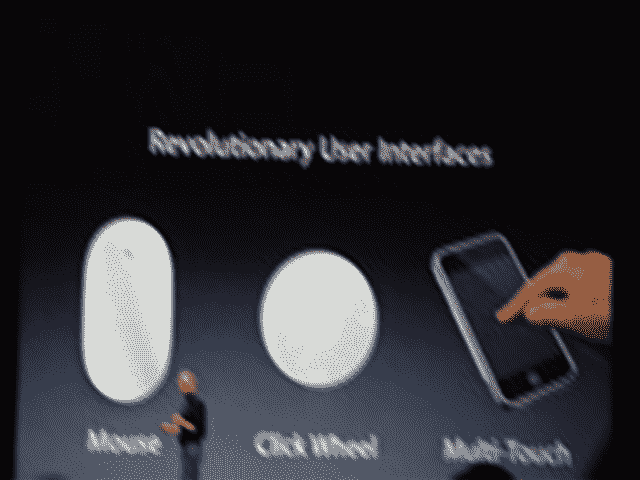
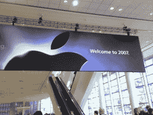

# 2007 年 MacWorld 大会:主题演讲

> 原文：<https://web.archive.org/web/http://techcrunch.com:80/2007/01/09/crunchgear-macworld-2007-the-keynote/>

这是 CrunchGear 在 MacWorld 2007 上报道苹果主题演讲的现场文字记录。

这里有更多关于 [MacWorld 2007](https://web.archive.org/web/20190403110203/http://www.crunchgear.com/?s=macworld)
的文章

* * *

11:00 PST–Iphone 希望在 2007 年改变行业。"我滑向冰球将要去的地方，而不是它已经去过的地方."掌声雷动。传输结束。

晚上 10:58——点击器失灵——问题。
一事无成。拖延——讲述他和沃兹如何制作电视干扰器。是..现在只是转卖。苹果股票刚刚涨了 5.26。他是谷歌/cingular 的首席执行官，也是雅虎的联合创始人。苹果现在是“苹果公司”

太平洋标准时间 10:52——Cingular SEZ:荣幸地与苹果合作——在他们签署合同之前，他们甚至没有看到手机。美国电话电报公司写了一本关于电信的书。

太平洋标准时间 10:50–可从 Cingular 商店和 Apple 商店购买。

太平洋标准时间 10:49–我们将在 6 月 7 日收到。亚洲得到它 08。他们与 Cingular 合作。

10:47 PST–4GB 型号为 499 美元。8GB 型号 599 美元。6 月上市。价格昂贵。

10:46 PST–Iphone 是*您口袋里的生活*成本是…耳机是疯狂的 200 项专利先进的艺术状态

太平洋标准时间 10:44–新耳机..内置麦克风和麦克风开关。新蓝牙。从今天起，人们不会再以同样的方式看待手机了。

太平洋标准时间 10:40–实时照片编辑和发送。多任务处理。

10:38 PST–网络上最伟大的两家公司，经济特区乔布斯。雅虎和谷歌同台？奇怪。

晚上 10:37——杨致远上场——雅虎+苹果。雅虎 Go-邮件和搜索。垃圾邮件防护。没有交换服务器的黑莓。

太平洋标准时间 10:34——苹果和谷歌首席执行官施密特就合并开玩笑——苹果咕。Google+苹果设备的传闻？雅虎搜索

太平洋标准时间 10:32–谷歌地图我真的很喜欢它。搜索，拨打某个地方很容易，卫星图像可以显示

太平洋标准时间 10:29——乔布斯恶作剧打电话给星巴克。

太平洋标准时间 10:27——苹果公司股价在消息公布后上涨了 2.50 美元。

10:26 PST–可以有多个网页..暴露/仪表板样式。拉德。

太平洋标准时间 10:24–像往常一样阅读电子邮件。双击可放大网页上的任何位置..也会缩小你。

太平洋标准时间 10:22–完整的桌面课程电子邮件。Safari 在上面看起来很热。他通过无线网络下载纽约时报。

太平洋标准时间 10:20–电子邮件显示非常好。富文本。可以按下显示在任何地方的电话号码，自动呼叫一个地方。

10:18 PST–小部件、谷歌地图、safari(全 html)，检测到后可以自动切换到 wifi。丰富的 HTML 电子邮件。将有免费的推邮件 imap 从雅虎。小部件。

10:17 PST–通过“捏捏”图像放大和缩小

10:16 PST–是的，短信。屏幕键盘。看起来像 ichat。

10:14 PST–短信看起来像 ichat。

10:13 PST–蒂姆·库克的语音邮件–收入结果。阿尔·戈尔打电话来？

太平洋标准时间 10:10——显然没有 3G。

太平洋时间 10:08——乔布斯致电 iPod 创始人乔恩·艾夫斯。使用触摸屏创建 conf 呼叫。

太平洋时间 10:05——黑仔应用正在拨打电话。与苹果或电脑同步。四频段 GSM + EDGE。蓝牙、WiFi。短信。随机接入语音邮件。

9:57 PST–通过滑动屏幕解锁手机。在 ITUNES 上挑选披头士乐队。类似仪表板的界面。拉吉·塞兹:伙计，这是我见过的最酷的手机。触摸屏像橡皮筋一样。橡皮筋，拉杰？

9:56 PST–4089961010–这是什么？接近传感器！把它面朝上，屏幕关闭。横向或纵向模式。Cingular 拿到了。对图像使用 coverflow。#数字是苹果的销售额#。

9:54 PST–3.5 英寸触摸屏。1 个按钮。电话按钮。比他们所有人都瘦。3.5 英寸。每英寸 160 像素。一个主页按钮。11.6 毫米薄。背面有 2mp 摄像头。顶部有耳机插孔。SIM 卡插槽。底部有麦克风。ipod 接头。手机内置 3 个传感器
。当你举起它去接电话时，它会自动关闭联系。
200 万像素摄像头。GSM。睡眠唤醒开关。

9:53 PST–通过 itunes… ical 通讯录同步。8GB 存储空间。

9:50 PST–Raj 特区:Iphone 运行 osx！它可以运行真正的桌面类应用程序。还有网络。

9:49 PST–多手指手势。”“那么，我们如何将它应用到移动设备上呢？去掉所有的按钮，做一个巨大的屏幕。那么，我们将如何交流呢？我们要用手写笔吗？不，谁想要笔针？恶心。触摸屏上的“QWERY”键盘。使用苹果操作系统 x。鼠标…滚轮…多点触控。

9:48 PST–Q，E62，黑莓–所有苹果手机的祖先。

9:46 PST–蛙跳产品。智能手机糟透了。这是一款宽大的触摸屏 ipod 手机，也是一款互联网通讯产品。

9:42 PST–行业变化项目。新的电话和互联网通讯器。苹果手机…干杯，干杯，干杯。所有的设备。触摸屏。宽屏 ipod 和手机。突破性的互联网通信设备。苹果手机的名字已经确认。

苹果电视到此为止。

太平洋标准时间 9:40–iTunes 资料库认证–选择要播放的内容。PIN？299 美元，2 月发货，今天就订购。Apple TV OUT！

9:37 PST–Cover flow 界面–就像新的 iTunes cover flow 一样。显示界面。

9:32 PST–Raj SEZ:Atv 接口是 rad。这就像 ipod 遇到了 zune。

太平洋标准时间 9:31–简单的苹果遥控器。10 部最近未观看的电影准备播放。PC 和 MAC。

晚上 9:28——将苹果电视连接到宽屏电视上。将内容流式传输到您的电视。720p 时的分量、hdmi 和输出。40gb 高清。802.11 wifi b g n(！！).英特尔芯片。Itv 现在的名称是苹果电视。无线流媒体。720p 时的分量、hdmi 和输出。40gb 高清。802.11 wifi (b g n)。英特尔处理器。高达 720p 的高清视频。40GB 用于视频。视频、音乐、照片。从多达五台电脑流式传输内容。

太平洋标准时间 9:27——苹果电视首次亮相。九月上市。

9:25–史蒂夫严厉批评 Zune–2%的市场份额。新的 iPod 广告。

太平洋时间 9:23-派拉蒙加入了 itunes。现在也在卖电影。美国第四大音乐零售商。

9:21 PST–ipod 上的信息–20 亿首歌曲。itunes 掉线是假的..itunes 在音乐方面的销量超过了亚马逊。itunes 上售出的节目超过 5000 万部

太平洋标准时间 9:20，吉姆·奥尔钦出场了？没有。霍奇曼和龙的 Vista 广告。大手术升级到 Vista。

太平洋标准时间 9:18–史蒂夫谈论 Vista。“几年前，我们搬到了英特尔。”零售店正在向转换者出售商品。

太平洋标准时间 9:16，人们站在座位上。史蒂夫的疯狂噪音。“我们今天正在创造历史。”

太平洋标准时间 9 点 11 分拉吉上场了。

太平洋标准时间 9:07–重大事件。显然 MacWorld Expo 的人让我们的人 Raj 很不好过。

太平洋标准时间 8:58–看起来我们已经就位了。 [Apple Store](https://web.archive.org/web/20190403110203/http://store.apple.com/1-800-MY-APPLE/WebObjects/AppleStore) 宕机，意味着硬件正在路上。