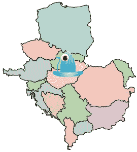

# CrunchGear 聚会:布达佩斯和华沙

> 原文：<https://web.archive.org/web/http://www.techcrunch.com:80/2007/07/20/crunchgear-meet-up-budapest-and-warsaw/>

iPhone 在这里，它是神话般的。我将在星期一早上抵达布达佩斯，我们将于 2007 年 7 月 23 日星期一 19:00 在布达佩斯的[马哈兹](https://web.archive.org/web/20160422031451/http://www.maghazblog.hu/)、[罗滕比勒 u. 32](https://web.archive.org/web/20160422031451/http://maps.google.com/maps?q=Rottenbiller+u.+32.+budapest+hungary&ie=UTF8&oe=utf-8&client=firefox-a&ll=47.504098,19.0766&spn=0.012901,0.029182&z=15&iwloc=addr&om=1) 会面。

如果你打算参加，请给我写封短信，地址是 crunchgear dot com，或者在评论里留言。期待与 CG/TC 读者见面。

特别感谢 [MobilPort.hu](https://web.archive.org/web/20160422031451/http://www.mobilport.hu/) ！

华沙的读者们:我们将于 7 月 26 日星期四 19:00 在波兰莫科托斯基的[酒吧 Lolek](https://web.archive.org/web/20160422031451/http://lolekpub.pl/) 举行波兰见面会。如果你要参加，请与我联系。