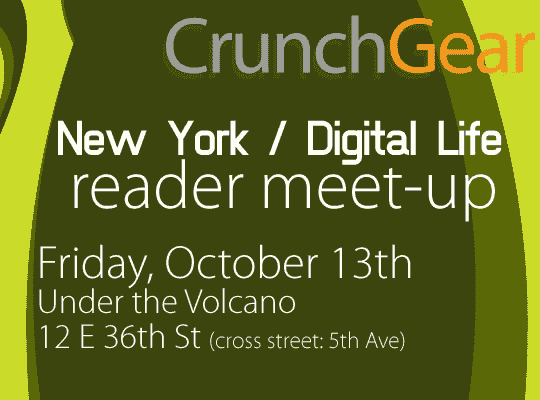

# CrunchGear Meet Up:赞助商阵容| TechCrunch

> 原文：<https://web.archive.org/web/http://techcrunch.com/2006/10/13/crunchgear-meet-up-sponsor-line-up/>

# 克朗彻奇聚会:赞助商阵容

特别感谢所有在最后一刻接近我们的人，特别感谢 Crunch 网络广告和 business folken，他们竭尽全力使这次活动取得成功。如果你已经回复了，请在晚上 7 点左右到达——先到先喝——并与约翰、乔希或布莱克登记，因为我们会为你们所有人提供一点乐趣和一些赠品。以下是赞助这个快乐火球的疯子/女人:

> 你的手机相当于你电脑的遥控器。你的手机上不需要安装任何东西，因为 SoonR 使用的是你手机上已经内置的功能。你只需在[www.soonr.com](https://web.archive.org/web/20130627214152/http://www.soonr.com/)登陆 SoonR 网站。SoonR 可以给你发一条带链接的短信，这样会更方便。

是一家社交媒体和公共关系咨询公司，总部位于纽约州威彻斯特县。

[点击此处了解更多信息](https://web.archive.org/web/20130627214152/http://crunchgear.com/2006/10/12/crunchgear-reader-meet-up-its-on/)