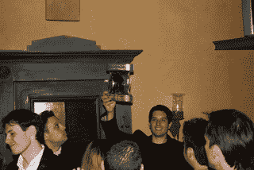
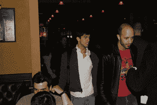

# CrunchGear 会议:后果

> 原文：<https://web.archive.org/web/http://techcrunch.com/2006/10/15/crunchgear-meet-up-the-aftermath/>

周五晚上，大约 100 名电脑怪才聚集在火山下，参加首次电脑怪才聚会。有很多酒和奖品，所有参加的人都非常高兴。

感谢大家的到来，我们很高兴见到你们，并期待着未来的聚会。也许是为了配合消费电子展。

如果其他人拍了照片，请发送到我们的 crunchgear dot com 帐户。

让我们再次感谢我们的赞助商。没有他们的支持和爱，这件事就不会发生。特别感谢[www.soonr.com](https://web.archive.org/web/20150927002755/http://www.soonr.com/)、爆破媒体[可爱的女士们](https://web.archive.org/web/20150927002755/http://blastmedia.com/)和[营销始于家庭有限责任公司](https://web.archive.org/web/20150927002755/http://www.marketingbeginsathome.com/)的大卫。

> 你的手机相当于你电脑的遥控器。你的手机上不需要安装任何东西，因为 SoonR 使用的是你手机上已经内置的功能。你只需登录 www.soonr.com 的 SoonR 网站。SoonR 可以给你发一条带链接的短信，这样会更方便。

是一家社交媒体和公共关系咨询公司，总部位于纽约州威彻斯特县。