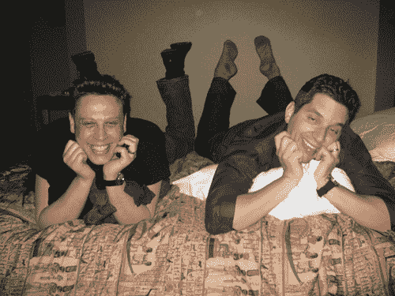

# 最后更新:布达佩斯是去！TechCrunch

> 原文：<https://web.archive.org/web/http://techcrunch.com/2007/07/22/crunchgear-meetup-final-update-budapest-is-go/>

我将于星期一早上抵达布达佩斯，我们将于 2007 年 7 月 23 日星期一 19:00 在布达佩斯的[马哈兹](https://web.archive.org/web/20160422033125/http://www.maghazblog.hu/)、[罗滕比勒大学 32](https://web.archive.org/web/20160422033125/http://maps.google.com/maps?q=Rottenbiller+u.+32.+budapest+hungary&ie=UTF8&oe=utf-8&client=firefox-a&ll=47.504098,19.0766&spn=0.012901,0.029182&z=15&iwloc=addr&om=1) 见面。

如果你打算参加，请给我写封短信，地址是 crunchgear dot com，或者在评论里留言。期待与 CG/TC 读者见面。我的格兰德中心号码是+16468270591，或者你可以用这个小工具给我打电话(如果你有美国手机的话)。对不起，欧洲！):

[http://embed . grand central . com/webcall/3fd 59 b 7 abf 3c 447 f 81173648 f 8537785](https://web.archive.org/web/20160422033125/http://embed.grandcentral.com/webcall/3fd59b7abf3c447f81173648f8537785)

如果您想在活动中发言或展示产品，请联系我。也可以短信我+14088215439。

特别感谢 [MobilPort.hu](https://web.archive.org/web/20160422033125/http://www.mobilport.hu/) ！

哦，我看起来像什么？点击[此处](https://web.archive.org/web/20160422033125/http://crunchgear.com/?page_id=2)或点击跳过跳转。

我就是右边那个穿着恶心的橙色袜子的人。