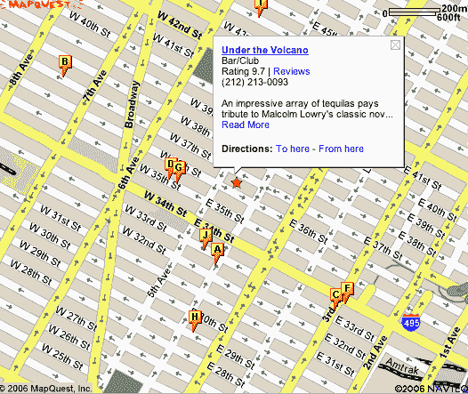

# 纽约/数字生活阅读器见面会| TechCrunch

> 原文：<https://web.archive.org/web/http://www.techcrunch.com:80/2006/10/02/crunchgear-new-yorkdigital-life-reader-meet-up>

# CrunchGear 纽约/数字生活阅读器见面会

加入我们的第一次读者见面会！该活动将与纽约的[数字生活](https://web.archive.org/web/20130627213022/http://www.digitallife.com/flash.html)同时举行，我们正在计划赠品，一个开放的酒吧，以及会见和辱骂 CrunchGear 编辑约翰、布莱克和乔希的机会。

### 什么时候？

2006 年 10 月 13 日–晚上 7 点

### 在哪里？

**[火山下](https://web.archive.org/web/20130627213022/http://newyork.citysearch.com/profile/11408274/new_york_ny/under_the_volcano.html)
东 36 街 12 号(十字街:第五大道)**

将您的名字添加到 [MollyGuard](https://web.archive.org/web/20130627213022/http://crunchgearnymeetup.mollyguard.com/) 以预订一个位置。我们想在进行最终确认之前统计一下人数，所以请尽快回复。

如果你想赞助这项活动，请写信给我们的赞助女主人珍妮。我们希望在这次活动中有一些参展商，所以如果你想向一群酷酷的 CrunchGear 粉丝展示你的产品，越多越好。