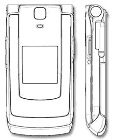

# CrunchGear 真正令人兴奋的版本:新三洋发现！

> 原文：<https://web.archive.org/web/http://techcrunch.com/2007/05/25/crunchgear-really-exciting-edition-new-sanyo-spotted/>

嗨，Sprint 用户们！我听说你们得到了一些很酷的手机。比如三洋武士刀。那个电话太棒了！还有更好的消息，因为猜猜联邦通信委员会的网站上刚刚出现了什么？这是武士刀的新版本，具有蓝牙、更大的外部显示器、2.5 毫米耳机插孔和内置天线等功能。非常令人兴奋的东西。你上次触摸内置天线是什么时候？

这款手机的厚度与旧武士刀相同，但新手机的高度和宽度分别缩短了 4 毫米和 2 毫米。多棒啊。！这就意味着，你可以用一支 Bic 笔把它放在口袋里。太酷了。目前还不知道这款完全超酷的手机何时上市，但 Sprint 用户应该开始每天去当地的 Sprint 商店询问“Omg，你有新的武士刀吗？”接着是一个可怕的武士姿势。啊，星期五。

[FCC 网站上发现新的三洋武士刀](https://web.archive.org/web/20160129072649/http://www.phonescoop.com/news/item.php?n=2213)