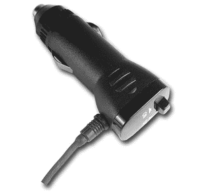

# CrunchGear 间谍版:为你的汽车安装 GPS 干扰器

> 原文：<https://web.archive.org/web/http://techcrunch.com/2007/07/31/crunchgear-spy-edition-gps-jammer-for-your-car/>

来自中国的反追踪器 GPS 干扰小工具对于间谍或偏执的人来说是完美的，他们认为自己很重要，其他人正在追踪他们的所有行动。它由你汽车的打火机插座供电，并声称可以摧毁你汽车上的 GPS 记录或跟踪设备。反追踪器发出 200 毫瓦的干扰能量！还没有价格，但请经常回来查看。*叹息*

[产品页面](https://web.archive.org/web/20150926052852/http://www.chinavasion.com/product_info.php/pName/tiny-anti-tracker-gps-blocker-in-car-use/)【via[导航](https://web.archive.org/web/20150926052852/http://www.navigadget.com/index.php/2007/07/31/gps-jammer-against-tracking-devices/)